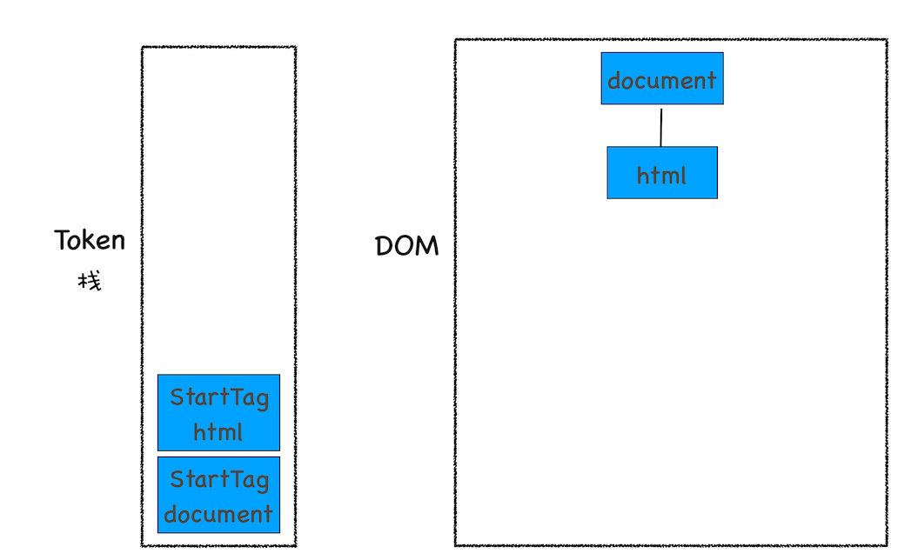

[toc]

# 宏观视角上的浏览器

## 01 | Chrome 架构：仅仅打开了 1 个页面，为什么有 4 个进程

chrome 浏览器进程查看方法：chrome 选项菜单->更多工具->任务管理器

### 进程和线程

#### 定义

进程是程序的运行实例。当启动一个程序的时候，OS 会为该程序分配一块内存，用来存放代码、运行数据和执行任务的主线程，我们把这样一个运行环境叫进程。

线程不能单独存在，它们由进程启动和管理，它们依附于进程，在进程中使用多线程并行处理能提升运算效率。

#### 什么是并行处理

计算机中的并行处理就是同一时刻处理多个任务

#### 线程 VS 进程

进程和线程之间的关系有以下特点：

1. 进程中任意一个线程出错，都会导致进程崩溃
2. 线程之间共享进程中的数据
3. 当一个进程关闭之后，OS 会回收进程所占用的内存
   当进程退出，OS 会回收该进程所申请的所有资源，包括其中线程因操作不当泄露的内存。
4. 进程之间的内容相互隔离
   如果进程之间需要进行数据通信，需要使用进程间通信（IPC）的机制

### 单进程浏览器时代

单进程浏览器是指浏览器的所有功能模块都是运行在同一个进程里，这些模块包含了网络、插件、JS运行环境、渲染引擎和页面等。在2007年之前，市面上的浏览器都是单进程的


如此多的功能模块运行在一个进程里，是导致单进程浏览器不稳定、不流畅和不安全的一个主要因素
1. 不稳定
   早期浏览器需要借助于插件来实现诸如web视频、web游戏等各种强大的功能，但是插件是最容易出问题的模块，并且还运行在浏览器进程中，所以一个插件的意外崩溃会引起整个浏览器的崩溃
   除插件外，渲染引擎模块也是不稳定的，通常一些复杂的JS代码就有可能引起渲染引擎模块的崩溃。渲染引擎崩溃也会导致浏览器的崩溃  
2. 不流畅  
   从上图可见，所有页面的渲染模块、JS执行环境以及插件都是运行在同一个线程中的，这就意味着同一时刻只能有一个模块可以运行，一旦有程序长时间占用线程（如JS死循环），就会导致整个浏览器失去响应、变卡顿  
   除了脚本或插件会让单进程浏览器变卡顿外，页面的内存泄露也是单进程变慢的一个重要原因。通常浏览器的内核都是很复杂的，运行一个复杂的页面再关闭，会存在内存不能完全回收的情况
3. 不安全
   插件可以用C/C++等代码编写，通过插件可以获取到OS的任意资源，当你在页面运行一个插件时也就意味着这个插件能完全操作你的电脑。如果这是个恶意插件，那么它就可以释放病毒、窃取你的账号密码，引发安全问题  
   至于页面脚本，它可以通过浏览器的漏洞来获取系统权限，这些脚本获取系统权限之后也可以对你的电脑做一些恶意的事情，同样也会引起安全问题
   
### 多进程浏览器时代

#### 早期多进程架构


从图中可以看出，Chrome的页面是运行在单独的渲染进程中的，同时页面里的插件也是运行在单独的插件进程之中，而进程之间是通过IPC机制进行通信  

如何解决不稳定的问题  
由于进程是相互隔离的，所以当一个页面或者插件崩溃时，影响到的仅仅是当前的页面进程或者插件进程，并不会影响到浏览器和其它页面，这就完美解决了页面或者插件的崩溃会导致整个浏览器崩溃，也就是不稳定的问题

如何解决不流畅的问题  
JS也是运行在渲染进程中的，所以即使JS阻塞了渲染进程，影响到的也只是当前的渲染页面，而并不会影响浏览器和其它页面，因为其它页面的脚本是运行在它们自己的渲染进程的。所以当我们再在Chrome中运行上面那个死循环的脚本时，没有相应的仅仅是当前的页面  
对于内存泄露的解决方法那就更简单了，因为当关闭一个页面时，整个渲染进程也会被关闭，之后该进程所占用的内存都会被系统回收，这样就解决了浏览器页面的内存泄露问题

如何解决安全问题
采用多进程架构的额外好处是可以使用安全沙箱，你可以把沙箱看成是OS给进程上了一把锁，沙箱里面的程序可以运行，但是不能在硬盘上写任何数据，也不能在敏感位置读取数据，例如你的文档和桌面。Chrome把插件进程和渲染进程锁在沙箱里面，这样即使在渲染进程或者插件进程里面执行了恶意程序，恶意程序也无法突破沙箱去获取系统权限

#### 目前多进程架构


从图中可以看出，最新的Chrome浏览器包括：1个浏览器（Browser)主进程、1个GPU进程、1个网络进程、多个渲染进程和多个插件进程

分析一下这几个进程的功能：
- 浏览器进程
  主要负责页面显示、用户交互、子进程管理，同时提供存储等功能
- 渲染进程
  核心任务是将HTML、CSS和JavaScript转换为用户可以与之交互的网页，排版引擎Blink和JavaScript引擎V8都是运行在该进程中，默认情况下，Chrome会为每个Tab标签创建一个渲染进程。处于安全考虑，渲染进程都是运行在沙箱模式下。
- GPU进程
  其实，Chrome刚开始发布的时候是没有GPU进程的。而GPU的使用热衷是为了实现3D CSS的效果，只是随后网页、Chrome的UI界面都选择采用GPU来绘制，这使得GPU成为浏览器普遍的需求。最后，Chrome在其多进程架构上也引入了GPU进程
- 网络进程
  主要负责页面的网络资源加载，之前是作为一个模块运行在浏览器进程里面的，直至最近才独立出来，称为一个单独的进程
- 插件进程
  主要负责插件的运行，因插件易崩溃，所以需要通过插件进程来隔离，以保证插件进程崩溃不会对浏览器和页面造成影响。

所以仅仅打开了一个页面，就启动了4个进程。因为打开1个页面至少需要1个网络进程、1个浏览器进程、1个GPU进程和1个渲染进程，共4个；如果打开的页面有运行插件的话，还需要再加上1个插件进程。

新架构带来的问题：
- 更高的资源占用
  因为每个进程都会包含公共基础结构的副本（如JS运行环境），这就意味着浏览器会消耗更多的内存资源
- 更复杂的体系架构
  浏览器各模块之间耦合性高、扩展性差等问题，会导致现在的架构已经很难适应新的需求

#### 未来面向服务的架构

为解决这些问题，在2016年，Chrome官方团队使用“面向服务的架构”（Services Oriented Architecture, 简称SOA）的思想设计了新的Chrome架构。也就是说Chrome整体架构会朝向现代OS所采用的“面向服务的架构”方向发展，原来的各种模块会被重构成独立的服务（Service），每个服务都可以在独立的进程中运行，访问服务必须使用定义好的接口，通过IPC来通信，从而构建一个更内聚、松耦合、易于维护和扩展的系统，更好实现Chrome简单、稳定、告诉、安全的目标。

Chrome最终要把UI、数据库、文件、设备、网络等模块重构为基础服务，类似OS底层服务，下面是Chrome“面向服务的架构”的进程模型图：


目前Chrome正处于老架构向服务化架构的过渡阶段

Chrome正在逐步构建Chrome基础服务（Chrome Foundation Service),如果你认为Chrome是“便携式操作系统”，那么Chrome基础服务便可以被视为该操作系统的“基础”系统服务层

同时Chrome还提供灵活的弹性架构，在强大性能设备上会以多进程的方式运行基础服务，但是如果在资源受限的设备上，Chrome会将很多服务整合到一个进程中，从而节省内存占用


### 总结

最初的浏览器都是单进程的，它们不稳定、不流畅且不安全，之后出现了Chrome，创造性引入了多进程架构，并解决了这些遗留问题。随后Chrome试图应用到更多业务场景，如移动设备、VR、视频等，为支持这些场景，Chrome架构体系变得越来越复杂，这种架构的复杂性倒逼Chrome开发团队必须进行架构的重构，最终Chrome团队选择了面向服务架构（SOA）形式，这也是Chrome团队现阶段的一个主要任务

### 思考问题

回顾浏览器的进化路线，你认为推动浏览器发展的主要动力是什么？


## 02 | TCP 协议：如何保证页面文件能被完整送达浏览器

在衡量 WEB 页面性能时有个重要指标叫“FP(First Patin)”，是指从页面加载到首次开始绘制的时长。这个指标直接影响了用户的跳出率，更快的页面响应意味着更多的 PV、更高的参与度，以及更高的转化率。FP 的一个重要的指标，就是网络加载速度。

要想优化 WEB 页面的加载速度，就需要对网络有充分的了解

### 一个数据包的旅程

以下会从

1. 数据包如何送达主机
2. 主机如何将数据包转交给应用
3. 数据是如何被完整地送达应用程序
   这三个角度讲述数据的传输过程

互联网，实际上是一套理念和协议组成的体系架构。

互联网中的数据是通过数据包来传输的。如果发送的数据很大，那么该数据就会被拆分为很多小数据包来传输，例如音频数据。

#### 1. IP：把数据包送达目的主机

数据包要在互联网上进行传输，就要符合网际协议(Internet Protocol，IP)标准。互联网上不同的在线设备都有唯一的地址，地址只是一个数字，这和大部分家庭收件地址类似，你只需要知道一个家庭的具体地址，就可以往这个地址发送包裹。

计算机的地址就是 IP 地址，访问任何网站实际上只是你的计算机向另一台计算机其你去信息。

如果想把一个数据包从 A 发送给主机 B，那么在传输之前，数据包上会被附加上主机 B 的 IP 地址信息，这样在传输过程中才能正确寻址。额外地，数据包上还会附加上主机 A 本身的 IP 地址，有了这些信息，主机 B 才可以回复信息给主机 A。这些附加的信息会被装进一个叫 IP 头的数据结构里。IP 头是 IP 数据包开头的信息，包含 IP 版本、源 IP 地址、生存时间等信息

下面记录下一个数据包从主机 A 到主机 B 的旅程

1. 上层将数据包交给网络层
2. 网络在再将 IP 头附加到数据包上，组成新的 IP 数据包，并交给底层
3. 底层通过物理网络将数据包传输给主机 B
4. 数据包被传输到主机 B 的网络层，在这里主机 B 拆开数据包的 IP 头信息，并将拆开来的数据部分交给上层
5. 最终，数据包就到达了主机 B 的上层

#### 2. UDP：把数据包送达应用程序

IP 是非常底层的协议，只负责把数据包传送到对方电脑，但是对方电脑并不知道把数据包交给哪个程序，是交给浏览器还是王者荣耀？因此，需要基于 IP 之上开发能和应用打交道的协议，最常见的是"用户数据包协议（User Datagram Protocol)",简称 UDP

UDP 中一个最重要的信息就是端口号，每个想访问网络的程序都需要绑定一个端口号。通过端口号 UDP 就能把指定数据包发给指定的程序了，所以 IP 通过 IP 地址信息把数据包发送给指定的电脑，而 UDP 通过端口号把数据包分发给正确的程序。和 IP 头一样，端口号会被装进 UDP 头里，UDP 头再和原始数据包合并组成新的 UDP 数据包。UDP 头中除了目的端口，还有源端口等信息

下面记录下一个数据包从主机 A 到主机 B 的旅程

1. 上层将数据包交给传输层
2. 传输层会在数据包前面附加上 UDP 头，组成新的 UDP 数据包，在将 UDP 数据包交给网络层
3. 网络在再将 IP 头附加到数据包上，组成新的 IP 数据包，并交给底层
4. 底层通过物理网络将数据包传输给主机 B 的网络层，在这里主机 B 拆开 IP 头信息，并将拆开来的数据部分交给传输层
5. 在传输层，数据包中的 UDP 头会被拆开，并根据 UDP 中所提供的的端口号，把数据部分交给上层的应用程序
6. 最终，数据包就到达了主机 B 的上层应用程序处

在使用 UDP 发送数据时，有各种因素会导致数据包出错，虽然 UDP 可以校验数据是否正确，但是对于错误的数据包，UDP 并不提供重发机制，只是丢弃当前的包，而且 UDP 在发送之后也无法知道是否能达到目的地。

虽然 UDP 不能保证数据可靠性，但是传输速度缺很快，所以 UDP 会应用在一些关注速度，但不那么严格要求数据完整性的领域，如在线视频，互动游戏等

#### 3. TCP：把数据完整地送达应用程序

对于浏览器请求，或者邮件这类要求数据传输可靠性的应用，如果使用 UDP 来传输会存在两个问题：

1. 数据包在传输过程中已丢失
2. 大文件会被拆分为很多小数据包来传输，这些小的数据包会经过不同的路由，并在不同的时间到达接收端，而 UDP 协议并不知道如何组装这些数据包，从而把这些数据包还原成完整的文件

基于这两个问题，我们引入了 TCP（Transmission Control Protocol，传输控制协议）是一种面向连接的、可靠的、基于字节流的传输层通信协议。TCP 有以下特点：

1. 对于数据包丢失的情况，TCP 提供重传机制
2. TCP 引入了数据包排序机制，用来保证把乱序的数据包组成一个完整的文件

TCP 头除了包含目标端口和本机端口外，还提供了用于排序的序列号，以便接收端通过序号来重排数据包

完整的 TCP 连接的生命周期包括了“建立连接”、“传输数据”、和“断开连接”三个阶段

### 总结

1. 互联网中的数据时通过数据包来传输的，数据包在传输过程中容易丢失和出错
2. IP 负责把数据包送达目的主机
3. UDP 负责把数据包送达具体应用
4. TCP 保证了数据的完整传输，它的连接分为三阶段：建立连接、传输数据、断开连接

## 03 | HTTP 请求流程：为什么很多站点第二次打开速度会很快

一个 TCP 连接过程包括：建立连接、传输数据、关闭连接

HTTP 协议建立在 TCP 连接基础之上。HTTP 是一种允许浏览器向服务器请求获取资源的协议，是 Web 的基础，通常由浏览器发起请求，用来获取不同类型的文件，例如 HTML 文件、CSS 文件、JavaScript 文件、图片、视频等。此外，HTTP 也是浏览器使用最广的协议，所以要想学好浏览器，就必须学好 HTTP

疑问点：

1. 为啥通常首次访问某站点速度很慢，再次访问就会变快
2. 当登录过一个网站之后，下次再访问该站点，就已经处于登录状态了，这是怎么做到的

这一切的秘密都隐藏在 HTTP 的请求过程中

### 浏览器端发起 HTTP 请求流程

假设我们在浏览器地址栏中键入：http://baidu.com

#### 1. 构建请求

首先浏览器构建请求行信息，构建好后，浏览器准备发起网络请求

```
GET /index.html HTTP1.1
```

#### 2. 查找缓存

在真正发起网络请求之前，浏览器会先在浏览器缓存中查询是否有请求的文件。其中，浏览器缓存是一种在本地保存资源副本，以供下次请求时直接使用的技术

当浏览器发现请求的资源已经在缓存中，它会拦截请求，返回该资源的副本，并直接结束请求，而不会再去源服务器重新下载，如此可以：

- 缓解服务器端压力，提升性能（获取资源耗时更短）
- 对于网站来说，缓存是实现快速资源加载的重要组成部分

如果缓存查找失败，就会进入网络请求过程

#### 3. 准备 IP 地址和端口

浏览器使用 HTTP 协议作为应用层协议，用来封装请求的文本信息；并使用 TCP/IP 作为传输层协议将它发到网络上，所以在 HTTP 工作开始之前，浏览器需要通过 TCP 与服务器建立连接。也就是说 HTTP 的内容是通过 TCP 传输数据阶段来实现的。

问题：

- HTTP 网络请求的第一步是做什么呢？
  浏览器会请求 DNS 返回域名对应 IP。浏览器提供了 DNS 数据缓存服务，如果某域名已经解析过了，那么浏览器会缓存解析结果，以供下次查询时直接使用（减少一次网络请求）
- 建立连接的信息都有了吗？
- 如何获取 IP 地址和端口号呢？
  如果 URL 没有特别指明端口号，那么 HTTP 协议默认的是 80 端口

#### 4. 等待 TCP 队列

Chrome 有个机制，同一个域名同时最多只能建立 6 个 TCP 连接，如果在同一个域名下同时有 10 个请求发生，那么其中 4 个就会进入排队等待状态，直至进行中的请求完成

#### 5. 建立 TCP 连接

排队等待结束之后，就可以和服务器握手了，在 HTTP 工作开始之前，浏览器通过 TCP 与服务器建立连接。

#### 6. 发送 HTTP 请求

一旦建立 TCP 连接，浏览器就可以和服务器进行通信了。而 HTTP 中的数据正是在这个通信过程中传输。

首先浏览器想服务器发送请求行，它包括请求方法、请求 URI（Uniform Resource Identifier)和 HTTP 版本协议

发送请求行，就是告诉服务器浏览器需要什么资源，最常用的请求方法是 GET。

另一常用请求方法为 POST，它用于发送一些数据给服务器。POST 方法的请求数据要通过请求体来发送

在浏览器发送请求行之后，还要以请求头的形式发送其它信息，把浏览器的一些基础信息告诉服务器。如浏览器所使用的的 OS、浏览器内核信息，以及当前请求的域名信息、浏览器端的 Cookie 信息等等

### 服务器端处理 HTTP 请求流程

HTTP 的请求信息被送达服务器后，服务器会根据浏览器的请求信息来准备响应的内容

#### 1. 返回请求

一旦服务器处理结束，就可以返回数据给浏览器。可以通过 curl 来查看返回请求数据：

```
curl -i https://baidu.com
```

-i 选项是为了返回响应行、响应头和响应体的数据

首先服务器会返回响应行，包括协议版本和状态码。但并不是所有请求都可以被服务器处理，对于无法处理或者处理出错的信息，服务器会通过请求行的状态码来告诉浏览器它的处理结果，如：

- 最常用的状态码是 200，表示处理成功
- 如果没找到页面，会返回 404
- 等

服务器会随同响应向浏览器发送响应头。响应头包含了服务器自身的一些信息，比如服务器生成返回数据的时间、返回数据的类型（JSON、HTML、流媒体等），以及服务器要在客户端保存的 Cookie 信息

#### 2. 断开连接

一旦服务器向客户端返回了请求数据，它就要关闭 TCP 连接。不过如果浏览器或者服务器在头信息中添加了：

```
Connection:Keep-Alive
```

那么 TCP 连接在发送后仍然保持打开状态，这样浏览器就可以继续通过同一个 TCP 连接发送请求。保持 TCP 连接可以是省去下次请求时需要建立连接的时间，提升资源加载速度。比如：一个 web 页面中内嵌的图片来自同一个 web 站点，如果初始化了一个持久连接，你就可以服用该链接，以请求其它资源，而不需要重新再建立新的连接

#### 3. 重定向

特殊情况：比如你在 browser 中打开 geekbang.org 后，你回发现最终打开的页面地址是https://www.geekbang.org

两个 URL 不一样是因为涉及到重定向操作，响应行返回的状态码是 301，意思是告诉浏览器，我需要重定向到另一个网址，具体地址包含在响应头的 location 字段中个，接下来，浏览器获取 location 字段中的地址，并使用该地址重新导航，这就是一个完整重定向流程。

这种跳转并非必然，如你打开https://12306.cn,你回发现这个站点打不开。这是因为12306的服务器并没有处理跳转，故必须手动输入完整URL

### 问题解答

#### 1. 为什么很多站点第二次打开速度会很快

大概率是因为第一次加载页面的过程中，缓存了一些耗时的数据

哪些数据会被缓存：
1. DNS缓存
   在浏览器本地把对应的IP和域名关联起来
2. 页面资源缓存
   
   从上图第一次请求可以看出，当服务器返回HTTP响应头给浏览器时，浏览器时通过响应头中的Cache-Control字段来设置是否缓存该资源。通常，我们还需为这个资源设置一个缓存过期时长，而这个时长是通过Cache-Control中的Max-age参数来设置的
   这意味着，在该缓存资源还未过期的情况下，如果再次请求该资源，会直接返回缓存中的资源给浏览器
   如果缓存过期了，浏览器则会继续发起网络请求，并且在HTTP请求头中带上：
      If-None-Match: "4f80fxxx"
   服务器收到请求头后，会根据If-None-Match的值来判断请求的资源是否有更新
   - 如果没有更新，就返回304状态码
      相当于服务器告诉浏览器：这个缓存可以继续使用，这次就不重复发送数据给你了
   - 如果资源有更新，服务器就直接返回最新资源给浏览器

简要来说，很多网站第二次访问能够秒开，是因为这些网站把很多资源都缓存在了本地，浏览器缓存直接使用本地副本来回应请求，而不会产生真正的网络请求，从而节省了时间。同时，DNS数据也被浏览器缓存了，这又省去了DNS查询环节

#### 1. 构建请求

## 04 | 导航流程：从输入URL到页面展示，这中间发生了什么

## 05 | 渲染流程（上）：HTML、CSS和JavaScript，是如何变成页面的

按照渲染的时间顺序，流水线可以分为以下几个子阶段：构建DOM树、样式计算、布局阶段、分层、绘制、分块、光栅化和合成。在每个阶段过程中，应该重点关注以下三点内容：
+ 开始每个子阶段都有其输入的内容
+ 然后每个子阶段有其处理过程
+ 最终每个子阶段会生成输出内容

### 1. 构建DOM树

```
在控制台输入“document”后回车，就能看到完整的DOM树结构

输入内容：HTML文件
处理过程：HTML解析器解析
输出内容：树状结构的DOM
```
为什么要构建DOM树呢？这是因为浏览器无法直接理解和使用HTML，所以需要将HTML转换为浏览器能够理解的结构-DOM树  

DOM 和 HTML内容几乎是一样的，但是和HTMl不同的是，DOM是保存在内存中的树状结构，可以通过JS来查询或修改其内容

### 2. 样式计算（Recalculate Style)

CSS样式来源主要有三种
 + 通过link引用的外部CSS文件
 + <style>标记内的CSS
 + 元素的style属性内嵌的CSS

样式计算的目的是为了计算出DOM节点中每个元素的具体样式，这个阶段可以分为三步：
 + 把CSS转换为浏览器能够理解的结构
   浏览器也是无法直接理解这些纯文本的CSS样式，所以当渲染引擎接收到CSS文本时，会执行一个转换操作，将CSS文件转换为浏览器可以理解的结构-styleSheets，并且该结构同时具备了查询和修改功能，这会为后面的样式操作提供基础
 + 转换样式表中的属性值，使其标准化
   CSS文本中有很多属性值，如2em、blue、bold，这些类型数值不容易被渲染引擎理解，所以需要将所有值转换为渲染引擎容易理解的、标准化的计算值  
 + 计算出DOM树中每个节点的具体样式
   CSS继承：CSS继承就是每个DOM节点都包含有父节点的样式  
   样式层叠：层叠是CSS的一个基本特征，它是一个定义了如何合并来自多个源的属性值的算法。它在CSS处于核心地位，CSS的全称“层叠样式表”正是强调了这一点

样式计算阶段的目的是为了计算出DOM节点中每个元素的具体样式，在计算过程中需要遵守CSS的集成和层叠两个规则。这个阶段最终输出的内容是每个DOM节点的样式，并被保存在ComputedStyle的结构内  

如果想要了解每个DOM元素最终的计算样式，可以打开Chrome的“开发者工具”的element标签，然后选择Computed子标签

### 3. 布局阶段

有了DOM树和DOM树中元素的样式，还不足以显示页面，因为我们还不知道DOM元素的几何位置信息。那么接下来就需要计算出DOM树中可见元素的几何位置，我们把这个计算过程叫做布局。

Chrome在布局阶段需要完成两个任务：创建布局树和布局计算

1. 创建布局树
   DOM树中还包含很多不可见的元素。所以在显示之前，还要额外构建一棵只包含可见元素布局树
2. 布局计算
   在执行布局操作的时候，会把布局运算的记过重写回布局树中，所以布局树既是输入内容也是输出内容，这是布局阶段一个不合理的地方。针对这个问题，Chrome团队正在重构布局代码，下一代布局系统叫LayoutNG，试图更清晰地分离输入和输出

思考问题：
   如果下载CSS文件阻塞了，会阻塞DOM树的合成吗？会阻塞页面的显示吗？

## 06 | 渲染流程（下）：HTML、CSS和JavaScript，是如何变成页面的

回顾下前三个阶段的主要内容：在HTML页面内容被提交给渲染引擎会后，渲染引擎首先将HTML解析为浏览器可以理解的DOM；然后根据CSS样式表，计算出DOM树所有及诶按的样式；接着又计算每个元素的几何坐标位置，并将这些信息保存在布局树中。

### 4. 分层

页面中有很多复杂的效果，如一些复杂的3D变换、页面滚动，或者使用z-indexing做z轴排序等，为了更方便实现这些效果，渲染引擎还需要为特定的节点生成专用的图层，并生成一棵对应的图层树（LayerTree)  

浏览器的页面实际上分成了很多图层，这些图层叠加后合成了最终页面

并不是布局树的每个节点都包含一个图层，如果一个节点没有对应的图层，那么这个节点就从属于父节点的图层  

产生新图层的条件：
1. 拥有层叠上下文属性的元素会被提升为单独的一层
   - 文档根元素（<html>)
   - position为absolute|relative 且 z-index不为auto的元素
   - position为fixed|sticky的元素
   - flex容器的子元素，且z-index值不为auto
   - grid容器的子元素，且z-index值不为auto
   - opacity属性值小于1的元素
   - misx-blend-mode属性值不为normal的元素
   - 以下任意属性值不为none的元素
     - transform
     - filter
     - backdrop-filter
     - perspective
     - clip-path
     - mask/mask-image/mask-border
   - isolation属性值为isolate的元素
   - will-change值设定了任一属性而该属性在non-initial值时会创建层叠上下文的元素
   - contain属性值为layout、paint或者包含它们其中之一的合成值（如contain:strict、contain:content)的元素
2. 需要剪裁（clip）的地方也会被创建为图层

### 5. 图层绘制

渲染引擎会把一个图层的绘制拆分成很多小的绘制指令，然后再把这些指令按照顺序组成一个待绘制列表

### 6. 栅格化（raster)操作

绘制列表只是用来记录绘制顺序和绘制指令的列表，而实际上绘制操作是由渲染引擎中的合成线程来完成的。

当图层的绘制列表准备好之后，主线程会把该绘制列表提交（commit）给合成线程。

通常一个页面可能很大，但是用户只能看到其中的一部分，我们把用户可以看到的这个部分叫做视口（viewport)

合成线程会将图层划分为图块（tile），这些图块的大小通常是256 X 256 或者512 X 512

合成线程会按照视口附近的图块来优先生成位图，实际生成位图的操作是由栅格化来执行的。所谓的栅格化，是指图块转换为位图。而图块是栅格化执行的最小单位。渲染进程维护了一个栅格化的线程池，所有的图块栅格化都是在线程池内执行的。

栅格化过程都会使用GPU来加速生成，使用GPU生成位图的过程叫做快速栅格化，或者GPU栅格化，生成的位图被保存在GPU内存中。

### 7. 合成和显示

一旦所有的图块都被光栅化，合成线程就会生成一个绘制图块的命令-DrawQuad，然后将该命令提交给浏览器进程

浏览器进程里面有一个叫viz的组件，用来接收合成线程发过来DrawQuad命令，然后根据DrawQuad命令，将其页面内容绘制到内存中，最后再将内存显示在屏幕上。

### 渲染流水线大总结

从HTML到DOM、样式计算、布局、图层、绘制、光栅化、合成和显示。


结合上图，一个完整的渲染流程大致可总结为：
1. 渲染进程将HTMl内容转换为DOM树结构
2. 渲染引擎将CSS样式表转化为浏览器可以理解的styleSheets,计算出DOM节点的样式
3. 创建布局树，并计算元素的布局信息
4. 对布局树进行分层，并生成分层树
5. 为每个图层生成绘制列表，并将其提交到合成线程
6. 合成线程将图层分为图块，并在光栅化线程池中将图块转换为位图
7. 合成线程发送绘制命令DrawQuad给浏览器进程
8. 浏览器进程根据DrawQuad消息生成页面，并显示到显示器上

### 相关概念

重排、重绘和合成

1. 更新了元素的集合属性（重排）
   
   如果通过JS或者CSS修改元素的几何位置属性，例如改变元素的宽度、高度等，那么浏览器会触发重新布局，解析之后的一系列子阶段，这个过程就叫重排。无疑，重排需要更新完整的渲染流水线，所以开销也是最大的。
2. 更新元素的绘制属性（重绘）
   
   如果修改了元素的背景颜色，那么布局阶段将不会被执行，因为并没有引起几何位置的变换，所以就直接进入了绘制阶段，然后执行之后的一系列子阶段，这个过程就叫重绘。相对于重排操作，重绘省去了布局和分层阶段，所以执行效率会比重排操作要高一些。
3. 直接合成阶段
   如果更改一个既不要布局也不要绘制的属性，渲染引擎就会跳过布局和绘制，只执行后续的合成操作，我们把这个过程叫做合成。
   
   使用CSS的transform来实现动画效果，可以避开重排和重绘阶段，直接在非主线程上执行合成动画操作。这样的效率是最高的，因为是在非主线程上合成，并没有占用主线程的资源，另外也避开了布局和绘制两个子阶段，所以相对于重绘和重排，合成能大大提升绘制效率

### 思考时间

在优化web性能的方法中，减少重绘、重排是一种很好的优化方式，那么结合文中的分析，你能总结出来为什么减少重排、重绘能优化web性能吗？又有哪些具体的实践方法能减少重绘、重排呢？


# 浏览器中的 JavaScript 执行机制

## 07 | 变量提升：JavaScript代码是按顺序执行的吗

### 变量提升

声明和赋值

所谓的变量提升，是指在JavaScript代码执行过程中，JavaScript引擎把变量的声明部分和函数的声明部分提升到代码开头的“行为”。变量被提升后，会给变量设置默认值，这个默认值就是undefined

变量和函数声明在代码里的位置是不会改变的，是在编译阶段被JavaScript引擎放入内存中


JavaScript代码的执行流程
1. 编译阶段
   经过编译后，会生成两部分内容：执行上下文和可执行代码  
   执行上下文是JavaScript执行一段代码时的运行环境。在执行上下文中存在一个变量环境对象，该对象保存了变量提升内容
2. 执行阶段
   代码中出现相同的变量或者函数怎么办

### 总结

+ JavaScript代码执行过程中，需要先做变量提升，而之所以需要实现变量提升，是因为JavaScript代码在执行之前需要先编译
+ 在编译阶段，变量和函数会被存放在变量环境中，变量的默认值会被设置为undefined；在代码执行阶段，JavaScript引擎会从变量环境中去查找自定义的变量和函数
+ 如果在编译阶段存在两个相同的函数，那么最后定义的那个生效，因为后定义的会覆盖之前定义的

JavaScript的执行机制：先编译，后执行

## 08 | 调用栈：为什么JavaScript会出现栈溢出

哪些情况下才算是一段代码，才会在执行之前就进行编译并创建执行上下文：
1. 当JS执行全局代码的时候，会编译全局代码并创建全局上下文，而且在整个页面的生存周期内，全局执行上下文只有一份
2. 当调用一个函数的时候，函数体内的代码会被编译，并创建函数执行上下文，一般情况下，函数执行结束后，创建的函数执行上下文会被销毁
3. 当时用eval函数的时候，eval的代码也会被编译，并创建执行上下文

学习调用栈有以下好处：
1. 有助于了解JS引擎背后的工作原理
2. 有助于调试JS代码
3. 有助于通过面试

调用栈就是用来管理函数调用关系的一种数据结构。
+ 函数调用
  函数调用就是执行一个函数，具体使用方式是使用函数名称跟着一对小括号
+ 栈
  栈是一种满足后进先出特点的数据结构
+ JS调用栈
  JS引擎利用栈这种结构来管理执行上下文。在执行上下文创建好后，JS引擎会将执行上下文压入栈中，通常把这种用来管理执行上下文的栈称为执行上下文栈，又称调用栈

调用栈是JS引擎追踪函数执行的一个机制

在开发中，如何利用好调用栈
1. 利用浏览器查看调用栈信息
2. 栈溢出
   调用栈是有大小的，当入栈的执行上下文超过一定数目，JS引擎就会报错，我们把这种错误叫做栈溢出

### 总结

+ 每调用一个函数，JS引擎会为其创建执行上下文，并把该执行上下文压入调用栈，然后JS引擎开始执行函数代码
+ 如果一个函数A调用了另一个函数B，那么JS引擎会为B函数创建执行上下文，并将B函数的执行上下文压入栈顶
+ 当前函数执行完毕后，JS引擎会将该函数的执行上下文弹出栈
+ 当分配的调用栈空间被占满时，会引发“堆栈溢出”问题

###  思考问题

```js
function runStack(n){
   if(n === 0) return 100;
   return runStack(n - 2);
}
runStacck(50000);
```
以上程序执行时会出现栈溢出的问题，修改代码，以解决该问题

## 09 | 块级作用域：var缺陷以及为什么要引入let和const

JS的变量提升特性，导致很多与直觉不符的代码。

### 作用域

作用域是指在程序中定义变量的区域，该位置决定了变量的生命周期。通俗一点，作用域就是变量和函数的可访问范围，即作用域控制着变量和函数的可见性和生命周期

ES6之前，只存在全局作用域和函数作用域
+ 全局作用域
  全局作用域中的对象在代码中的任何位置都能访问，其生命周期伴随着页面的生命周期
+ 函数作用域
  函数作用域就是在函数内部定义的变量或者函数，并且定义的变量或者函数只能在函数内部被访问。函数执行结束之后，函数内部定义的变量会被销毁

变量提升带来的问题
1. 变量容易在不被察觉的时候被覆盖
2. 本应销毁的变量没有被销毁

ES6如何解决变量提升带来的缺陷
+ ES6引入了let和const关键字，从而使JS拥有了块级作用域

JS是如何支持块级作用域的

站在执行上下文角度来揭开答案

已知JS引擎是通过变量环境来实现函数级作用域的，那么ES又是如何在函数级作用域的基础之上，实现对块级作用域的支持呢？


## 10 | 作用域链和闭包：代码中出现相同的变量，JavaScript引擎是如何选择的

## 11 | this:从JavaScript执行上下文的视角讲清楚this

# V8 工作原理

## 12 | 栈空间和堆空间：数据时如何存储的

## 13 | 垃圾回收：垃圾数据时如何自动回收的

## 14 | 编译器和解释器：V8是如何执行一段JavaScript代码的


# 浏览器中的页面循环系统

## 15 | 消息队列和事件循环：页面是怎么“活”起来的

## 16 | WebAPI：setTimeout是如何实现的

## 17 | WebAPI：XMLHttpRequest是怎么实现的

## 18 | 宏任务和微任务：不是所有的任务都是一个待遇

## 19 | Promise：使用promise，告别回调函数

## 20 | async/await：使用同步的方式去写异步代码

# 浏览器中的页面

## 21 | Chrome开发者工具：利用网络面板做性能分析

Chrome开发者工具是工程师调试页面的核心工具。Chrome开发者工具(DevTools)是一组网页制作和调试的工具，内嵌于Google Chrome浏览器中。

### Chrome开发者工具

Chrome开发者工具有很多重要面板，比如与性能相关的有网络面板、Performance面板、内存面板等，与调试页面相关的有Elements面板、Sources面板、Console面板等。

你可以在浏览器窗口的右上方选择Chrome菜单，然后选择“更多工具->开发者工具”来打开Chrome开发者工具。

本章我们聚焦页面的源头和网络数据的接收，这些发送和接收的数据都能体现在开发者工具的网络面板上。


简言之，Chrome开发者工具为我们提供了通过界面访问或者编辑DOM和CSSOM的能力，还提供了强大的调试功能和查看性能指标的能力。
### 网络面板

网络面板由控制器、过滤器、抓图信息、时间线、详细列表和下载信息概要这6个区域构成，如下图所示：


1. 控制器
   控制器有4个比较重要的功能，如下图：
   

   * 红色远点按钮，表示“开始/暂停抓包"
   * “全局搜索”重要，可以在所有下载资源中搜索相关内容，还可以快速定位到某几个你想要的文件上
   * Disable Cache，即“禁止从Cache中加载资源”，它在调试WEB应用的时候非常有用，因为开启了Cache会影响到网络性能测试的结果
   * Online按钮，是“模拟2G/3G”功能，可以限制贷款，模拟弱网情况下页面的展现情况，然后你就可以根据实际展示情况来动态调整策略，以便让web应用更加适用于这些弱网。
2. 过滤器
   网络面板中的过滤器，主要就是起过滤作用。因为有时候一个页面有太多的内容在详细列表中展示了，而你可能只想查看JavaScript文件或者CSS文件，这时候就可以通过过滤器模块来筛选你想要的文件类型
3. 抓图信息
   抓图信息区域，可以用来分析用户等待页面加载时间所看到的的内容，分析用户实际的体验情况。比如，如果页面加载1s+之后屏幕截图还是白屏状态，这时候就需要分析是网络 还是代码的问题了。
4. 时间线
   时间线主要用来展示HTTP、HTTPS、WebSocket加载的状态和时间的关系，用于直观感受页面的加载过程。如果是多条数显堆叠在一起，那说明这些资源被同时加载。至于具体到每个文件的加载信息，还需要用到详细列表
5. 详细列表
   这个区域是最重要的，它记录了每个资源从发起请求到完成请求这中间所有过程的状态，以及最终请求完成的数据信息。通过该列表，很容易诊断一些网络问题
6. 下载信息概要
   下载信息概要中，需要重点关注DOMContentLoaded和Load两个事件，以及这两个事件的完成时间
   * DOMContentLoaded事件发生后，说明页面已经构建好DOM了，这意味着构建DOM需要的HTML文件、JavaScript文件、CSS文件都已经下载完成了
   * Load,说明浏览器已经加载了所有资源（图片、样式表等）
   通过下载信息概要面板，可以查看触发这两个事件所花费的时间

### 网络面板中的详细列表

1. 列表的属性
   列表的属性包括Name、Status、Type、Initiator等等
   可以按照列表属性给列表排序，默认情况下，列表是按请求发起的时间来排序的，最早发起请求的资源在顶部。当然也可以按照返回状态码、请求类型、请求时长、内容大小等基础属性排序，只需点击相应属性即可
2. 详细信息
   选中详细列表中的一项，右边就会出现该项的详细信息，如下：
   
   可以在此查看请求列表中任意一项的请求行和请求头信息，还可以查看响应行、响应头和响应体。然后你可以根据这些查看的信息来判断你的业务逻辑是否正确，或者有时候也可以用来逆向推到别人网站的业务逻辑。
3. 单个资源的时间线
   了解了每个资源的详细请求信息之后，再来分析单个资源请求时间线，这就涉及具体的HTTP请求流程了。
   
   发起一个HTTP请求之后，浏览器首先查找缓存，如果缓存没有命中，那么继续发起DNS请求获取IP地址，然后利用IP地址和服务器端建立TCP连接，再发送HTTP请求，等待服务器响应，不过，如果服务器响应头中包含了重定向的信息，那么整个流程就需要再重新走一遍。这就是在浏览器中一个HTTP请求的基础流程。
   详细列表中可以表示出这个流程，重点看下时间线面板：
   
   
   面板中这个项目到底是什么含义呢？

   第一个是Queuing(排队)，当浏览器发起一个请求的时候，会有很多原因导致该请求不能被立即执行，而是需要排队等待。导致处于排队状态的原因有很多：
   * 首先，页面中的资源是有优先级的，比如CSS、HTML、JavaScript等都是页面中的核心文件，所以优先级最高；而图片、视频、音频这类资源就不是核心资源，优先级就比较低。通常当后者遇到前者时，就需要“让路”，进入待排队状态
   * 其次，浏览器会为每个域名最多维护6个TCP连接，如果发起一个HTTP请求时，这6个TCP连接都处于忙碌状态，那么这个请求就会处于排队状态
   * 最后，网络进程在为数据分配磁盘空间时，新的HTTP请求也需要短暂地等待磁盘分配结束
   
   等待排队完成之后，就要进入发起连接的状态了。不过在发起连接之前，还有一些原因可能导致连接过程被推迟，这个推迟就表现在面板中的Stalled上，它表示停滞的意思

   额外说明：如果使用了代理服务器，还会增加一个Proxy Negotiation阶段，也就是代理协商阶段，它表示代理服务器连接协商所用时间。

   接下来就到了Initial connection/SSL阶段了，也就是和服务器建立连接的阶段，这包括了建立TCP连接所花费的时间；不过如果使用了HTTPs协议，那么还需要一个额外的SSL握手时间，这个过程主要是用来协商一些加密信息的

   和服务器建立好连接之后，网络进程会准备请求数据，并将其发送给网络，这就是Request sent阶段。通常这个阶段非常快，因为只需要把浏览器缓冲区的数据发送出去就结束了，并不需要判断服务器是否收到了，所以这个时间通常不到1毫秒

   数据发送出去了，接下来就是等待接收服务器第一个字节的数据，这个阶段称为Waiting（TTFB），通常也称为“第一字节时间”。TTFB是反映服务器响应速度的重要指标，对服务器来说，TTFB时间越短，就说明服务器响应越快。

   接收到第一个字节之后，进入陆续接收完整数据的阶段，也就是Content Download阶段，这意味着第一字节时间到接收到全部响应数据所用的时间。

### 优化时间线上的耗时项

1. 排队（Queuing）时间过长
   排队时间过久，大概率是由浏览器为每个域名最多维护6个连接导致的。那么基于这个原因，你就可以让1个站点下面的资源放在多个域名下面，比如放到3个域名下面，这样就可以同时支持18个连接了，这种方案称为域名分片技术。除了域名分片技术外，建议把站点升级到HTTP2，因为HTTP2已经没有每个域名最多维护6个TCP连接的限制了
2. 第一字节时间（TTFB）时间过久
   这可能的原因：
   * 服务器生成页面数据的时间过长
      对于动态网页来说，服务器收到用户打开一个页面的请求时，首先要从数据库中读取该页面需要的数据，然后把这些数据传入到模板中，模板渲染后，再返回给用户。服务器在处理这个数据的过程中，可能某个环节会出问题
   * 网络的原因
      比如使用了低带宽的服务器，或者本来用的是电信的服务器，可联通的网络用户要来访问你的服务器，这样也会拖慢网速
   * 发送请求头时带上了多余的用户信息
      比如一些不必要的Cookie信息，服务器接收到这些Cookie信息之后可能需要对每一项都做处理，这样就加大了服务器的处理时长

   对于这三种问题，要有针对性地出一些解决方案。面对第一种服务器的问题，可以想办法提高服务器的处理速度，比如通过增加各种缓存的技术；针对第二种网络问题，可以使用CDN来缓存一些静态文件；至于第三种，在发送请求时就去尽可能地减少一些不必要的Cookie数据信息
3. Content Download 时间过久
   如果单个请求的Content Download花费了大量时间，有可能是字节数太多的原因导致的。这时候就需要减少文件大小，比如压缩、去掉源码中不必要的注释等方法。
### 总结

如果要做一些实践性的项目优化，理解其背后的理论至关重要。因为理论就是一条“线”，它会把各种实践的内容串在一起，然后可以围绕着这条“线”来排查问题

## 22 | DOM树：JavaScript是如何影响DOM树构建的

本文会沿着网络数据流路径来介绍DOM树是怎么生成的。然后再基于DOM树的解析流程介绍两块内容：
1. 在解析过程中遇到JS脚本，DOM解析器是如何处理的
2. DOM解析器是如何处理跨站点资源的
   
### 什么是DOM

从网络传给渲染引擎的HTML文件字节流是无法直接被渲染引擎理解的，所以要将其转化为渲染引擎能够理解的内部结构，这个结构就是DOM。DOM提供了对HTML文档结构化的表达。在渲染引擎中，DOM有三个层面的作用：
1. 从页面视角来看，DOM是生成页面的基础数据结构
2. 从JS脚本视角看，DOM提供给JS脚本操作的接口，通过这套接口，JS可以对DOM结构践行访问，从而改变文档的结构、样式和内容
3. 从安全视角看，DOM是一道安全防护线，一些不安全的内容在DOM解析阶段就被拒之门外了

简言之，DOM是表述HTML的内部数据结构，它会将WEB页面和JS脚本连接起来，并过滤一些不安全的内容

### DOM 树如何生成

在渲染引擎内部，有一个叫HTML解析器（HTMLParser）的模块，它的职责就是负责将HTML字节流转换为DOM结构。

**问题**：HTML解析器是等整个HTML文档加载完成之后开始解析的，还是随着HTML文档变加载边解析的？
**答案**：HTML并不是等整个文档加载完成之后再解析的，而是网络进程加载了多少数据，HTML解析器便解析多少数据

**详细流程是什么样的呢？**
网络进程接收到响应头之后，会根据响应头中的content-type字段来判断文件的类型，比如content-type的值是“text/html",那么浏览器就会判断这是一个HTML类型的文件，然后为该请求选择或者创建一个渲染进程。渲染进程准备好之后，网络进程和渲染进程之间会建立一个共享数据的管道，网络进程接收到数据后就往这个管道里放，而渲染进程则从管道的另外一段不断地读取数据，并同时将读取的数据“喂”给HTML解析器。你可以把这个管道想想象成一个水管，网络进程接收到的字节流像水一样倒进这个“水管”，而“水管”的另外一端是渲染进程的HTML解析器，它会动态接收字节流，并将其解析为DOM

**DOM的具体生成流程**


从图中看出，字节流转换为DOM需要三个阶段：
1. 通过分词器将字节流转换为Token
   解析HTML，需要通过分词器先将字节流转换为一个个token，分为Tag Token和文本Token。上述HTML代码通过词法分析生成的token如下所示：
   
   由图看出Tag Token又分为StartTag和EndTag，分别对应于图中蓝、红色块，文本token对应绿色块
2. 后续第二三阶段是同步进行的，需要将Token解析为DOM节点，并将DOM节点添加到DOM树中
   HTML解析器维护了一个Token栈结构，该Token栈主要用来计算节点之间的父子关系，在第一个阶段中生成的token会被按顺序压到这个栈中
   * 如果压入到栈中的是StartTag Token，HTMl解析器会为该Token创建一个DOM节点，然后将该节点加入到DOM树中，它的父节点就是栈中相邻的那个元素生成的节点
   * 如果分词器解析出来的是文本token，那么会生成一个文本节点，然后将该节点加入到DOM树中，文本token是不需要压入到栈中的，它的父节点就是当前栈顶token所对应的DOM节点
   * 如果分词器解析出来的是EndTag标签，HTML解析器会查看Token栈顶元素是否是相应的StartTag，如果是，就将StartTag从栈中弹出，表示该元素解析完成

通过分词器产生的新Token就这样不停地入栈和出栈，整个解析过程就这样一直持续下去，直到分词器将所有字节流分词完成

举个例子：
```html
<html>
   <body>
      <div>1</div>
      <div>test</div>
   </body>
</html>
```
这段代码以字节流的形式传给了HTML解析器，经过分词器处理，解析出来的第一个token是StartTag html，解析出来的token入栈，并同时创建一个html的DOM节点，将其加入到DOM树中
**HTML解析器开始工作时，会默认创建一个根为document的空DOM结构**，同时会将一个StartTag document的token入栈。然后经过分词器解析出来的第一个StartTag html token会入栈，并创建一个html的DOM节点，添加到document上


然后按照同样的流程解析出来的StartTag body和StartTag div，其token栈和dom的状态如下：


接下来解析出来的是第一个div的文本token，渲染引擎会为该token创建一个文本节点，并将该token添加到dom中，它的父节点就是当前token栈顶元素对应的节点，如下图：


再接下来，分词器解析出来第一个EndTag div，这时候HTML解析器回去判断当前栈顶元素是否是StartTag div，如果是则从栈顶弹出StartTag div：


按照同样的规则，一路解析，最终结果如下：


以上就是DOM的生成过程。不过在实际生产环境中，HTML源文件即包含CSS和JS，又包含图片、音频、视频等文件，所以处理过程远要复杂于以上DEMO。

### JavaScript是如何影响DOM生成的
再来个复杂点的HTMl文件：
```html
<html>
   <body>
      <div>1</div>
      <script>
         let div1 = document.getElementsByTagName('div')[0];
         div1.innerText = 'haha';
      </script>
   </body>
</html>
```
以上，<script>标签之前，所有的解析流程还是和之前介绍的一样，但是解析到<script>标签时，渲染引擎判断这是一段脚本，此时HTML解析器就会暂停DOM解析，因为接下来JS可能要修改当前已经生成的DOM结构

通过前面DOM生成流程分析，我们已经知道当解析到script脚本标签时，其DOM树结构如下所示：

这时HTML解析器暂停工作，JavaScript引擎接入，并执行script标签中的这段脚本，因为这段JavaScript脚本修改了DOM中第一个div中的内容，所以执行这段脚本之后，div节点内容已经修改为haha了。脚本执行完成之后，HTML解析器恢复解析过程，继续解析后续的内容，直至生成最终的DOM

除了在页面中直接内嵌JavaScript脚本之外，我们通常需要在页面中引入JavaScript文件，这个解析过程就稍微复杂了点：
```js
//foo.js
let div1 = document.getElementsByTagName('div')[0];
div1.innerText = 'haha';
```

```html
<html>
   <body>
      <div>1</div>
      <script type="text/javascript" src="foo.js"></script>
      <div>test</div>
   </body>
</html>
```
执行到JavaScript标签时，暂停整个DOM的解析，执行JavaScript代码，不过这里执行JavaScript时，需要先下载这段JavaScript代码。这里需要重点关注下载环境，因为**JavaScript文件的下载过程会阻塞DOM解析**，而通常下载有时非常耗时的，会受网络环境、JavaScript文件大小等因素的影响。

不过Chrome浏览器做了很多优化，其中一个主要的优化是预解析操作。当渲染引擎收到字节流之后，会开启一个预解析线程，用来分析HTML文件中包含的JavaScript、CSS等相关文件，解析到相关文件之后，预解析线程会提前下载这些文件

再回到DOM解析上，我们知道引入JavaScript线程会阻塞DOM，不过也有一些相关的策略来规避，比如使用CDN来加速JavaScript文件的加载，压缩JavaScript文件的体积。另外，如果JavaScript文件中没有操作DOM相关代码，就可以将该JavaScript脚本设置为异步加载，通过async或defer来标记代码，使用如下所示：
```
<script async type="text/javascript" src='foo.js'></script>
```

```
<script defer type="text/javascript" src='foo.js'></script>
```
async和defer虽都是异步的，不过还有些差异，使用async标志的脚本文件一旦加载完成，会立即执行；而使用了defer标记的脚本文件，需要在DOMContentLoaded事件之前执行

现在我们知道JS是如何阻塞DOM解析的了，那接下来再看另一种情况：
```css
/* theme.css */
div {
   color: blue
}
```

```html
<html>
   <head>
      <style src='theme.css'></style>
   </head>
   <body>
      <div>1</div>
      <script>
         let div1 = document.getElementsByTagName('div')[0];
         div1.innerText = 'haha';
         div1.style.color = 'red';
      </script>
      <div>test</div>
   </body>
</html>
```
示例中，JavaScript代码出现了div1.style.color='red'的语句，它是用来操纵CSSOM的，所以在执行JavaScript之前，需要先解析JavaScript语句之上所有的CSS样式。所以如果代码里引用了外部的CSS文件，那么在执行JavaScript之前，还需要等待外部的CSS文件下载完成，并解析生成CSSOM对象之后，才能执行JavaScript脚本

JavaScript引擎在解析JavaScript之前，是不知道JavaScript是否操纵了CSSOM的，所以渲染引擎在遇到JavaScript脚本时，不管该脚本是否操纵了CSSOM，都会执行CSS文件下载，解析操作，再执行JavaScript脚本

所以说JavaScript脚本是依赖样式表的，这又多了一个阻塞过程。

通过分析可知，JavaScript会阻塞DOM生成，而样式文件又会阻塞JavaScript的执行，所以在实际的工程中需要重点关注JavaScript文件和样式表文件，使用不当会影响到页面性能的

### 总结

渲染引擎还有一个安全检查查模块叫XSSAuditor，是用来检测词法安全的。在分词器解析出来Token之后，它会检测这些模块是否安全，比如是否引用了外部脚本，是否符合CSP规范，是否存在跨站点请求等。如果出现不符合规范的内容，XSSAuditor会对该脚本或者下载任务进行拦截

### 思考时间

看下面代码，你认为打开这个HTML页面，页面显示的内容是什么？
```html
<html>
   <body>
      <div>1</div>
      <script>
         let div1 = document.getElementsByTagName('div')[0];
         div1.innerText = 'haha';

         let div2 = document.getElementsByTagName('div')[1];
         div2.innerText = 'hehe';
      </script>
      <div>test</div>
   </body>
</html>
```
## 23 | 渲染流水线：CSS如何影响首次加载时的白屏时间

本文我们先站在渲染流水线的视角来介绍CSS是如何工作的，然后通过CSS的工作流程来分析性能瓶颈，最后来谈论如何减少首次加载时的白屏时间。

### 渲染流水线视角下的CSS

我们先结合下面代码来看看渲染流程：
```css
/* theme.css */
div {
   color: coral;
   background-color: black
}
```

```html
<html>
   <head>
      <link href="theme.css" rel="stylesheet">
   </head>
   <body>
      <div>haha</div>
   </body>
</html>
```
以上两段代码由CSS文件和HTML文件构成，我们来分析下打开这段HTML文件时的渲染流水线，可以先参考下面这张渲染流水线：

下面我们结合上图来分析这个页面文件的渲染流水线

首先是发起主页面的请求，这个发起请求方可能是渲染进程，也有可能是浏览器进程，发起的请求被送到网络进程中去执行。网络进程接收到返回的HTML数据之后，将其发送给渲染进程，渲染进程会解析HTML数据并构建DOM。这里需要注意：请求HTML数据和构建DOM中间有一段空闲时间，这个空闲时间有可能成为页面渲染的瓶颈

当渲染进程接收HTML文件字节流时，会先开启一个预解析线程，如果遇到JavaScript文件或者CSS文件，那么预解析线程会提前下载这些数据。对于上面的代码，预解析线程会解析出来一个外部的theme.css文件，并发起theme.css的下载。这里也有一个空闲时间需要注意，就是DOM构建结束之后、theme.css文件还未下载完成的这段时间内，渲染流水线无事可做，因为下一步是合成布局树，而合成布局树需要CSSOM和DOM，所以这里需要等待CSS加载结束并解析成CSSOM

**那渲染流水线为什么需要CSSOM呢？**

渲染引擎无法直接理解CSS文件内容，所以需要将其解析成渲染引擎能够理解的结构，这个结构就是CSSOM。和DOM一样，CSSOM也具有两个作用：
1. 提供给JavaScript操作样式表的能力
2. 为布局树的合成提供基础的样式信息

这个CSSOM体现在DOM中就是document.styleSheets。具体结构可以查询相关资料。

有了DOM和CSSOM，接下来就可以合成布局树了。等DOM和CSSOM都构建好之后，渲染引擎就会构建布局树。布局树的结构基本就是复制DOM树的结构，不同之处在于DOM树中那些不需要显示的元素会被过滤掉，如display:none属性的元素、head标签、script标签等。复制好基本的布局树机构之后，渲染引擎会为对应的DOM元素选择对应的央视信息，这个过程就是样式计算。样式计算完成之后，渲染引擎还需要计算布局树中每个元素对应的几何位置，这个过程就是计算布局。通过样式计算和计算布局就完成了最终布局树的构建。在之后，就该进行后续的绘制操作了

这就是在渲染过程中涉及到CSS的一些主要流程

看个稍微复杂点的场景：
```css
/* theme.css */
div {
   color: coral;
   background-color: black
}
```

```html
<html>
   <head>
      <link href="theme.css" rel="stylesheet">
   </head>
   <body>
      <div>haha</div>
      <script>
         console.log("heiheihei");
      </script>
      <div>hehe</div>
   </body>
</html>
```
以上渲染流水线与之前略有不同：

解析DOM的过程中，如果遇到JavaScript脚本，那么需要先暂停DOM解析去执行JavaScript，因为JavaScript有可能会修改当前状态下的DOM

不过在执行JavaScript脚本之前，如果页面中包含了外部CSS文件的引用，或者通过style标签内置了CSS内容，那么渲染引擎还需要将这些内容转换为CSSOM，因为JavaScript有修改CSSOM的能力，所以在执行JavaScript之前，还需要依赖CSSOM。也就是说CSS在部分情况下也会阻塞DOM的生成

看个更复杂点的场景：
```css
/* theme.css */
div {
   color: coral;
   background-color: black
}
```

```js
/* foo.js */
console.log("heiheihei");
```

```html
<html>
   <head>
      <link href="theme.css" rel="stylesheet">
   </head>
   <body>
      <div>haha</div>
      <script src="foo.js"></script>
      <div>hehe</div>
   </body>
</html>
```
渲染流水线如下图：

从图中看出，在接收到HTML数据之后的预解析过程中，HTML预解析器识别出来了有CSS文件和JavaScript文件需要下载，然后就同时发起两个文件的下载请求，需要注意的是，这两个文件的下载过程是重叠的，所以下载时间按照最久的那个文件来算

后面的流水线就和前面一样，不管是CSS文件和JavaScript文件谁先到达，都要先等到CSS文件下载完成并生成CSSOM，然后再执行JavaScript脚本，最后再继续构建DOM，构建布局树，绘制页面。

### 影响页面展示的因素以及优化策略

为什么要大力分析渲染流水线呢？因为渲染流水线影响到了首次页面展示的速度，而首次页面展示的速度又直接影响到了用户体验。所以分析渲染流水线的目的就是为了找出一些影响首屏展示的因素，然后再根据这些因素做一些针对性的调整

从发起URL请求开始，到首次显示页面的内容，在视觉上经历了三个阶段：
1. 请求发出后，到提交数据阶段，这时页面展示出来的还是之前页面的内容
2. 提交数据之后渲染进程会创建一个空白页面，我们通常把这段时间称为解析白屏，并等待CSS文件和JavaScript文件的加载完成，生成CSSOM和DOM，然后合成布局树，最后经过一系列步骤准备首次渲染
3. 首次渲染完成之后，就开始进入完整页面的生成阶段，然后页面会一点点被绘制出来

影响第一阶段的因素主要是网络或者服务器处理这块儿
第二阶段主要问题是白屏时间，如果白屏时间过长，就会影响到用户体验。为了缩短白屏时间，要挨个分析这个阶段的主要任务，包括解析HTML、下载CSS、下载JavaScript、生成CSSOM、执行JavaScrpt、生成布局树、绘制页面一系列操作

通常瓶颈主要体现在：下载CSS文件、下载JavaScript文件和执行JavaScript

所以要想缩短白屏时间，可以：
* 通过内联JavaScript、内联CSS来移除这两种类型的文件下载，这样获取到HTML文件之后就可以直接开始渲染流程了
* 尽量减少文件大小，如使用webpack等工具移除不必要的注释，并压缩JavaScript文件
* 将不需要解析HTML阶段使用的JavaScript标记上async或者defer
* 对于大的CSS文件，可以通过媒体查询属性，将其拆分为不同用途的CSS文件，这样只在特定情境下才会加载特定的CSS文件

### 总结

首先介绍了CSS在渲染流水线中的位置，以及CSS是如何影响到渲染流程的；接下来通过渲染流水线分析了从发出请求到首次页面绘制的三个阶段；最后重点介绍了第二个阶段白屏阶段以及优化该阶段的一些策略

JavaScript和CSS给我们带来了很大比那里，不过也对页面渲染带来很多限制，所以要关注资源加载速度，需要小心翼翼处理各种资源之间的关联关系

### 思考时间

当你横屏方向拿着手机时，打开一个页面，观察下面击中资源的加载方式，你认为哪几种会阻塞页面渲染？为什么
```html
<script src="foo.js" type="text/javascript"></script>
<script defer src="foo.js" type="text/javascript"></script>
<script sync src="foo.js" type="text/javascript"></script>
<link rel="stylesheet" type="text/css" href="foo.css"/>
<link rel="stylesheet" type="text/css" href="foo.css" media="screen"/>
<link rel="stylesheet" type="text/css" href="foo.css" media="print"/>
<link rel="stylesheet" type="text/css" href="foo.css" media="orientation:landscape"/>
<link rel="stylesheet" type="text/css" href="foo.css" media="orientation:portrait"/>
```

## 24 | 分层和合成机制：为什么CSS动画比JavaScript高效

本文主要讲解渲染引擎的分层和合成机制，因为分层和合成机制代表了浏览器最为先进的合成 技术，Chrome团队为了做到这一点，做了大量的优化工作。了解其工作原理，有助于拓宽视野，也能更深刻理解CSS动画和JavaScript底层工作机制

### 显示器是怎么显示图像的

每个显示器都有固定的刷新频率，通常是60HZ，也就是每秒更新60张图片，更新的图片都来自于显卡中一个叫前缓冲区的地方，显示器所做的就是每秒固定60次前缓冲区中的图像，并将读取的图像显示到显示器上

**那么这里显卡叫什么呢？**

显卡的职责就是合成新的图像，并将图像保存到后缓冲区，一旦显卡把合成的图像写到后缓冲区，系统就会让后缓冲区和前缓冲区互换，这样就能保证显示器能读取到最新显卡合成的图像。通常情况下，显卡的更新频率和显示器的刷新频率是一致的。但有时候，在一些复杂的场景中，显卡处理一张图片的速度会变慢，这样就会造成视觉上的卡顿
### 帧 VS 帧率

当通过滚动条滚动页面，或者通过手势缩放页面时，屏幕上就会产生动画效果。之所以能感觉得有动画的效果，是因为在滚动或者缩放操作时，渲染引擎会通过渲染流水线生成新的图片，并发送到显卡的后缓冲区

大多数设备屏幕的更新频率是60次/秒，这也就意味着正常情况下要实现流畅的动画效果，渲染引擎需要每秒更新60张图片到显卡的后缓冲区

我们把渲染流水线生成的每一副图片称为一帧，把渲染流水线每秒更新了多少帧称为帧率，如滚动过程中1秒更新了60帧，那么帧率就是60Hz（或者60FPS）

由于用户很容易观察到丢失的帧，如果在一次动画过程中，渲染引擎生成某些帧的时间过久，那么用户就会感受到卡顿，这会给用户造成非常不好的印象

要解决卡顿问题，就要解决每帧生成时间过久的问题，为此Chrome对浏览器渲染方式做了大量的工作，其中最卓有成效的策略就是引入了分层和合成机制。分层和合成机制代表了当今最先进的渲染技术

### 如何生成一帧图像

任意一帧的生成方式，有重排、重绘和合成三种方式

这三种方式的渲染路径是不同的，通常渲染路径越长，生成图像花费的时间就越多。比如**重排**，它需要重新根据CSSOM和DOM来计算布局树，这样生成一幅图片时，会让整个渲染流水线的每个阶段都执行一遍，如果布局复杂的话，就很难保证渲染的效率了。而**重绘**因为没有了重新布局的阶段，操作效率稍微高点，但依然需要重新计算绘制信息，并触发绘制操作之后的一系列操作

相较于重排和重绘，**合成**操作的路径就显得非常短了，并不需要触发布局和绘制两个阶段，如果采用了GPU，那么合成的效率会非常高

关于渲染引擎生成一帧图像的几种方式，按照效率我们推荐合成方式优先，若是在不能满足需求，那么就再退后一步使用重绘或者重排的方式

### 分层和合成

通常页面的组成是非常复杂的，有的页面里要实现一些复杂的动画效果，比如点击菜单时弹出菜单的动画特效，滚动鼠标滚轮时页面滚动的动画效果，当然还有一些炫酷的3D动画特效。如果没有采用分层机制，从布局树直接生成目标图片的话，那么每次页面有很小的变化时，都会触发重排或者重绘机制，这种“牵一发而动全身”的绘制策略会严重影响页面的渲染效率。

**为了提升每帧的渲染效率，Chrome引入了分层和合成的机制。那该怎么来理解分层和合成机制呢？**

你可以把一张网页想象成是由很多图片叠加在一起的，每个图片就对应一个图层，Chrome合成器最终将这些图层合成了用于显示页面的图片。

在这个过程中，将素材分解为多个图层的操作就称为分层，最后将这些图层合并成一起的操作就称为合成，所以，分层和合成通常是一起使用的

考虑到一个页面被划分为两个层，当进行到下一帧的渲染时，上面的一帧可能需要实现某些变化，如平移、旋转、缩放、阴影或者Alpha渐变，这时候合成器只需要将两个层进行相应的变化操作就可以了，显卡处理这些操作驾轻就熟，所以这个合成过程时间非常短

**理解了为什么要引入合成和分层机制，那chrome是怎么实现分层和合成机制的**

在chrome的渲染流水线中，分层体现在生成布局树之后，渲染引擎会根据布局树的特点将其转换为层树（Layer Tree），层树是渲染流水线后续流程的基础结构

层树中的每个节点都对应着一个图层，下一步的绘制阶段就依赖于层树中的节点。绘制阶段其实并不是真正的绘出图片，而是将绘制指令组合成一个列表，比如一个图层要设置的背景为黑色，并且还要在中间画一个圆形，那么绘制过程会生成|Paint BackGroundColor:Black|Paint Circle|这样的绘制指令列表，绘制过程就完成了

有了绘制列表之后，就需要进入光栅化阶段了，光栅化就是按照绘制列表中的指令生成图片。每一个图层都对应一张图片，合成线程有了这些图片之后，会将这些图片合成“一张”图片，并最终将生成的图片发送到后缓冲区。

需要重点关注的是，合成操作是在合成线程上完成的，这也就意味着在执行合成操作时，是不会影响到主线程执行的。这就是为什么经常主线程卡住了，但是css动画依然能执行的原因

### 分块

如果说分层是从宏观上提升了渲染效率，那么分块则是从微观层面提升了渲染效率

通常，页面的内容都要比屏幕大得多，显示一个页面时，如果等待所有的图层都生成完毕，再进行合成的话，会产生一些不必要的开销，也会让合成图片的时间变得更久

因此，合成线程会将每个图层分割为大小固定的图块，然后优先绘制靠近视口的图块，这样就可以大大加速页面的显示速度。不过有时候，即使只绘制那些优先级最高的图块，也要耗费不少的时间，因为涉及到一个很关键的因素-纹理上传，这是因为从计算机内存上传到GPU内存的操作会比较慢

为解决这个问题，Chrome又采取了一个策略：**在首次合成图片的时候使用一个低分辨率的图片**。比如可以是正常分辨率的一半，分辨率减少一半，纹理就减少了四分之三。在首次显示页面内容的时候，将这个低分辨率的图片显示出来，然后合成器继续绘制正常比例的网页内容，当正常比例的网页内容绘制完成后，再替换掉当前显示的低分辨率内容。这种方式尽管会让用户在开始时看到的是低分辨率的内容，但是也比用户在开始时什么都看不到要好

### 如何利用分层技术优化代码

在web应用中，可能经常需要对某个元素做几何形式变化、透明度变换或者一些缩放操作，如果使用JavaScript来写这些效果，会牵涉到整个渲染流水线，所以JS的绘制效果会非常低下

这时可以使用will-change来告诉渲染引擎你会对该元素做一些特殊变换，CSS代码如下：
```css
.box {
   will-change: transform, opacity;
}
```
这段代码就是提前告诉渲染引擎box元素将要做几何变换和透明度变换操作，这时候渲染引擎会将该元素单独实现一帧，等这些变换发生时，渲染引擎会通过合成线程直接去处理变换，这些变换并没有涉及到主线程，这样就大大提升了渲染的效率。**这也是CSS动画比JavaScript动画高效的原因**

所以，如果涉及到一些可以使用合成线程来处理CSS特效或者动画的情况，就尽量使用will-change来提前告诉渲染引擎，让它为该元素准备独立的层。但是凡事都有两面性，每当渲染引擎为一个元素准备一个独立层的时候，它占用的内存也会大大增加，因为从层树开始，后续每个阶段都会多一个层结构，这些都需要额外的内存，所以需要恰当使用will-change

### 总结

1. 首先我们介绍了显示器显示图像的原理，以及帧和帧率的概念，然后基于帧和帧率我们又介绍渲染引擎是如何实现一帧图像的。通常渲染引擎生成一帧图像有三种方式：重排、重绘、合成。其中重排和重绘操作都是在渲染进程的主线程上执行的，比较耗时；而合成操作是在渲染进程的合成线程上执行的，执行速度快，且不占用主线程
2. 然后介绍了浏览器是怎么实现合成的，其技术细节主要可以使用三个词来概括：分层、分块和合成
3. 最后是CSS动画比JS动画高效的原因，以及怎么使用will-change来优化动画或特效
## 25 | 页面性能：如何系统地优化页面

页面优化，就是要让页面更快的显示和响应。

页面的三个阶段：加载、交互、关闭
* 加载阶段，是指从发出请求到渲染出完整页面的过程，影响到这个阶段的主要因素有网络和JS脚本
* 交互阶段，是从页面加载完成到用户交互的整合过程，影响到这个阶段的主要因素是JS脚本
* 关闭阶段，是用户发出关闭指令后页面所做的一些清理操作

影响用户体验的因素主要在加载阶段和交互阶段
### 加载阶段

先看个典型的渲染流水线：


并非所有的资源都会阻塞页面的首次绘制，比如图片、音频、视频等文件就不会阻塞页面的首次渲染；而JavaScript、首次请求的HTML资源文件、CSS文件会阻塞首次渲染，因为在构建DOM的过程中需要HTML和JavaScript文件，在构造渲染树的过程中需要用到CSS文件


## 26 | 虚拟DOM：虚拟DOM和实际的DOM有是很么不同

## 27 | 渐进式网页应用（PWA）：它究竟解决了web应用的哪些问题

## 28 | WebComponent:像搭积木一样构建Web应用

# 浏览器中的网络

## 29 | HTTP/1：HTTP性能优化

## 30 | HTTP/2：如何提升网络速度

## 31 | HTTP/3：甩掉TCP、TLS的包袱，构建高效网络

# 浏览器安全

## 32 | 同源策略：为什么XMLHTTPRequest不能跨域请求资源

## 33 | 跨站脚本攻击（XSS):为什么Cookie中有HTttpOnly属性

## 34 | CSRF攻击：陌生连接不要随便点

## 35 | 安全沙箱：页面和系统之间的隔离墙

## 36 | HTTPS:让数据传输更安全
