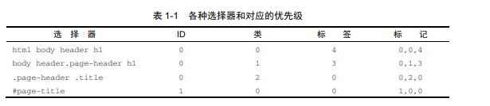

[toc]

# 1. 层叠、优先级和继承

## 1.1 层叠

CSS本质上就是声明规则。CSS开发很重要的一点就是以可预测的方式书写规则。
层叠指的是一系列规则。它决定了如何解决冲突，是CSS语言的基础。  

当声明冲突时，层叠会根据三种条件解决冲突：
1. 样式表的来源 
   样式是从哪里来的，包括你的样式和浏览器默认样式
2. 选择器优先级 
   哪些选择器比另一些选择器更重要
3. 源码顺序 
   样式在样式表里的声明顺序

规则概括图表，展示了声明的优先顺序：
  

~~~
术语解释
以下是CSS中的一行。它被称作一个声明。该声明由一个属性（color)和一个值（black)组成。
    color: black;
包含在大括号内的一组声明被称作一个声明块。声明块前面有一个选择器(如下面的body)
    body {
        color: black;
        font-family: Helvetica;
    }
选择器和声明块一起组成了规则集（ruleset)。一个规则集也简称一个规则（rule），但更多人用复数（rules)来指一系列样式的集合。

最后，@规则(at-rules)是指用“@”符号开头的语法。比如@import规则或者@media查询。
~~~

### 1.1.1 样式表的来源

你添加到网页里的样式表并不是浏览器唯一使用的样式表，还有其它类型或者来源的样式表。

你的样式表属于**作者样式表**，除此之外还有用户代理样式表，即浏览器默认样式。用户代理样式表优先级低，你的样式会覆盖它们。

说明： 有些浏览器允许用户定义一个用户样式表。这是第三种来源，它的优先级介于用户代理样式表和作者样式表之间。用户样式表很少见，并且不受网站作者控制。  

用户代理样式在不同浏览器上稍有差异，但大体上做相同的事情：为标题（从h1到h6）和段落(p)添加上下外边距，为列表（ol或者ul)添加左侧内边距，为链接添加颜色，为元素设置各种默认字号  

1. 用户代理样式  
  浏览器应用了用户代理样式后才会应用你的样式表，即作者样式表。你指定的声明会覆盖用户代理样式表里的样式。如果你在HTML里面链接了多个样式表，那么它们的来源都相同，即作者。  
2. !imporrtant声明  
  样式来源规则有一个例外：标记为important的声明。  
    color: red !important;
  标记了!important的声明会被当做更高优先级的来源，因此总体的优先级按照由高到底排列如下所示：  
    + 作者的!important  
    + 作者  
    + 用户代理  

层叠独立地解决了网页中每个元素的样式属性的冲突。

### 1.1.2 理解优先级

如果无法用来源解决冲突声明，浏览器会尝试检查它们的优先级。理解优先级很重要。

浏览器将优先级分为两个部分：HTML的行内样式和选择器的样式  
1. 行内样式
    如果用HTMl的style属性写样式，这个声明只会作用于当前元素。实际上行内元素属于“带作用域”的声明，它会覆盖任何来自样式表或者<style>标签的样式。行内样式没有选择器，因为它们直接作用于所在的元素。  
    为了在样式表里覆盖行内声明，需要为声明添加!important,这样能将它提升到一个更高优先级的来源。但如果行内样式也被标记为!important，就无法覆盖它了。最好是只在样式表中使用!important.  
2. 选择器优先级  
    优先级的第二部分由选择器决定。比如，有两个类名的选择器比只有一个类名的选择器优先级更高。但选择器的长度并不是决定优先级的唯一因素。  
    不同类型的选择器有不同的优先级。比如：ID选择器比类选择器优先级更高。实际上,ID选择器的优先级比拥有任意多个类的选择器都高。同理：类选择器的优先级比标签选择器更高。    
    优先级的准确规则如下：  
    + 如果选择器的ID数量更多，则它会胜出（即它更明确）  
    + 如果ID数量一致，那么拥有最多类的选择器胜出  
    + 如果以上两次比较都一致，（但不要把它们加到你的网页中），它们是按照优先级由低到高的顺序排列的。   

    说明：伪类选择器（如：hover)和属性选择器(如[type="input"])与一个类选择器的优先级相同。通用选择器（*）和组合选择器（>、+、-）对优先级没有影响。  
    
    如果你在CSS里写了一个声明，但是没有生效，一般是因为被更高优先级的规则覆盖了。ID选择器会创建更高的优先级，之后被覆盖。如果要覆盖一个ID选择器的样式，就必须用另一个ID选择器。
3. 优先级标记
    一个常用的表示优先级的方式是用数值方式来标记，通常用逗号隔开每个数，比如"1,2,2"表示选择器由1个ID、2个类、2个标签组成。优先级最高的ID列为第一位，紧接着是类，最后是标签。
      
    现在通过比较数值就能决定哪个选择器优先级更高。"1,0,0"的优先级高于"0,2,2"、"0,10,0",因为第一个数（ID)有最高优先级。  
    有时，人们还会用4个数的标记，其中将最重要的位置用0或1来表示，代表一个声明是否是用行内样式添加的。此时，行内样式的优先级为（1,0,0,0)。它会覆盖通过选择器添加的样式，比如"0,1,2,0"的选择器。  
4. 关于优先级的思考  
   !important注释将声明提升到了更高优先级的来源。这个方法很简单，也很低级。当给一个些声明加上!important时，就会先比较来源，再使用常规的优先级规则。最终会让一切回到起点：一旦引入一个!important，就会带来更多的!important  
   更好的方法是：不要绕开选择器的优先级，而是利用它来解决问题。  
   通常最好让优先级尽可能低，这样当需要覆盖一些样式时，才能有选择空间。

### 1.1.3 源码顺序

层叠的最后一步，是源码顺序。如果两个声明的来源和优先级相同，其中一个声明在样式表中出现较晚，或者位于页面较晚引入的样式表中，则该声明胜出。  

面对一个样式问题时，可以分两个步骤来解决：
+ 确定哪些声明可以实现效果
+ 思考可以用哪些选择器结构，然后选择最符合需求的那个  
  
1. 链接样式和源码顺序
   书写顺序之所以很重要，就是因为层叠。
2. 层叠值
   浏览器遵循三个步骤，即来源、优先级、源码顺序，来解析网页上的每个元素的每个属性。如果一个声明在层叠中“胜出”，它就被称作一个**层叠值**。  
   元素的每个属性最多只有一个层叠值。  
   层叠值 - 作为层叠结果，应用到一个元素上的特定属性的值。

### 1.1.4 两条经验法则

1. 在选择器中不要使用ID
2. 不要使用!important
   
这两条规则是很好的建议，但不必固守它们，因为也有例外。

## 1.2 继承

最后一个给元素添加样式的方式是：继承。  
如果一个元素的某个属性没有层叠值，则可能会继承某个祖先元素的值。  
不是所有的属性都能被继承。默认情况下，只有特定的一些属性能被继承，通常是我们希望被继承的哪些。它们主要是跟文本先关的属性：color font font-family font-size font-weight font-variant font-style line-height letter-spacing text-align text-indent text-transform white-space word-spacing  
还有一些其它的属性也可以被继承，比如列表属性：list-style list-style-type list-style-position以及list-style-image。表格的边框属性border-collapse和border-spacing也能被继承。注意：这些属性控制的是表格的边框行为，而不是常用于指定非表格元素边框的属性。

## 1.3 特殊值 

有两个特殊值可以赋给任意属性，用于控制层叠：inherit和initial  

### 1.3.1 使用inherit关键字

当想用继承代替一个层叠值，就可以用inherit关键字。可以用它来覆盖另一个值，这样该元素就会继承其父元素的值。

### 1.3.2 使用initial关键字

当需要撤销作用于某个元素的样式。这可以用initial关键字来实现。  
每一个CSS属性都有初始（默认）值。如果将initial值赋给某个属性，那么就会有效地将其重置为默认值，这种操作相当于硬复位了该值。  
auto不是所有属性的默认值，对很多属性来说甚至不是合法的值。  

说明：声明display: initial等价于display:inline。不管应用关于哪种类型的元素，它都不会等于display:block。 这是因为initial重置为属性的初始值，而不是元素的初始值。inline才是display属性的初始值。

## 1.4 简写属性

简写属性是用于同时给多个属性赋值的属性。比如font是一个简写属性，可以用于设置多种字体属性。它指定了font-style、font-weight、font-size、font-height以及font-family。  
还有如下属性：
+ background  
  多个背景属性的简写：background-color、background-image、background-size、background-repeat、background-position、background-origin、background-chip以及background-attachment  
+ border  
  border-width、border-style以及border-color的简写属性，而这几个属性也都是简写属性
+ border-width  
  上、右、下、左四个边框宽度的简写属性

### 1.4.1 简写属性会默默覆盖其它样式

大多数简写属性可以省略一些值，只指定我们关注的值。但是要知道，这样仍然会设置省略的值，即它们会被隐式地设置为初始值。这会默默覆盖其它地方定义的样式。

### 1.4.2 理解简写值的顺序

简写属性会尽量包含指定的属性值的顺序。可以设置border: 1px solid black 或者 border: black 1px solid，两者都会生效。这是因为浏览器知道宽度、颜色、边框样式分别对应什么类型的值。  

但是有很多属性的值很模糊。在这种情况下，值的顺序很关键。  
1. 上 右 下 左 
   当遇到像margin、padding这样的属性，还有为元素的四条边分别指定值的边框属性时，开发者容易弄错这些简写属性的顺序。这些属性的值都是按照顺时针方向，从上边开始的。   
2. 水平、垂直  
   还有一些属性只支持最多指定两个值，这些属性包括background-position、box-shadow、text-shadow(虽然严格来说它们并不是简写属性)。这些属性值的顺序跟padding这种四值属性的顺序正好相反，比如,padding：1em 2em先指定了垂直方向上的上下属性值，然后才是水平方向的右、左属性值。而 background-position:25%   75%则先指定水平方向的右/左属性值，然后才是垂直方向的上/下属性值。  
   虽然看起来顺序相反的定义违背了直觉，原因却很简单：这两个值代表了一个笛卡尔网格。笛卡尔网格的测量值一般是按照x,y(水平、垂直)的顺序来的。

## 1.5 总结
   + 控制选择器的优先级
   + 不要混淆层叠和继承
   + 某些属性会被继承，包括文本、列表、表格边框相关的属性
   + 不要混淆initial和auto值
   + 简写属性要注意TRouBLe的顺序，避免踩坑

# 2. 相对单位

&emsp;像素(px)是绝对单位。em和rem,是相对单位。相对单位的值会根据外部因素发生变化。

## 2.1 相对值的好处

CSS为网页带来了后期绑定(late-binding)的样式：直到内容和样式都完成了，二者才会结合起来。

### 2.1.1 那些年追求的像素级完美

&emsp;&emsp;在Web环境下，用户可以设置浏览器窗口的大小，而CSS必须适应这种窗口大小。此外，当网页打开后，用户还可以缩放网页，CSS还需要适应新的限制。也就是说，不能在刚创建网页时就应用样式，而是等到要将网页渲染到屏幕上时，才能去计算样式。  
&emsp;&emsp;这给CSS增加了一个抽象层。我们无法根据理想的条件给元素添加样式，而是要设置无论元素处于任意条件，都能够生效的规则。现在的web环境下，网页需要既可以在4英寸的手机屏幕上渲染，也可以在30英寸的大屏幕上渲染。  
&emsp;&emsp;在很长时间内，网页设计者通过“像素级完美”的设计来降低这种复杂性。它们会创建一个紧凑的容器，通常是居中的一栏，大约800px宽。然后再像之前的本地应用程序或者印刷出版物那样，在这些限制里面进行设计。

### 2.1.2 像素级完美的时代终结了

随着技术的发展，加上制造商推出高清显示器，像素级完美的方式逐渐走向了终点。在21世纪初，大家开始讨论是否可以安全地将网页宽度设计为1024px，而不是800px。随后人们又开始讨论是否要将网页宽度设计为1280px。当时我们得做出选择：到底是让网页宽于旧计算机，还是窄于新计算机。  
等到智能手机出现后，人们再也无法假设每个用户访问网站的体验都能一样。无论如何，都得抛弃那种固定宽度的栏目设计，开始考虑响应式设计。我们无法逃避CSS带来的抽象性。我们得拥抱它。

响应式：在CSS中指的是样式能够根据浏览器窗口的大小有不同的“响应”。这要求有意地考虑任何尺寸的手机、平板设备，或者桌面屏幕。  

相对单位就是CSS用来解决此类问题的一种工具。我们可以基于窗口大小来等比例地缩放字号，而不是固定为14px，或者将网页上的任何元素的大小都相对于基础字号来设置，然后只用改一行代码就能缩放整个网页。

~~~
像素、点、派卡

CSS支持几种绝对长度单位，最常用、最基础的是像素（px)。不常用的绝对单位是mm（毫米）、cm(厘米)、in(英寸)、pt(点，印刷术语，1/72英寸)、pc(派卡，印刷术语，12点)。这些单位都可以通过公式互相换算：1in = 25.4mm = 2.54cm = 6pc = 72pt = 96px
~~~

## 2.2 em 和 rem

em是最常见的相对长度单位，适合基于特定的字号进行排版。在CSS中，1em等于当前元素的字号，其准确值取决于作用的元素。  

浏览器会根据相对单位的值计算出绝对值，称作计算值（computed value)

当设置padding、height、width、border-radius等属性时，使用em会很方便，因为当元素继承了不同的字号，或者用户改变了字体设置时，这些属性会跟着元素均匀地缩放

### 2.2.1 使用 em 定义字号

当前元素的字号决定了em。但如果声明font-size：1.2em，那么font-size是根据继承的字号来计算的

对于大多数浏览器来说，默认的字号是16px。准确来说，medium关键字的值是16px

### 2.2.2 使用 rem 设置字号

## 2.3 停止像素思维

## 2.4 视口的相对单位

## 2.5 无单位的数值和行高

## 2.6 自定义属性

## 2.7 总结

   

 

