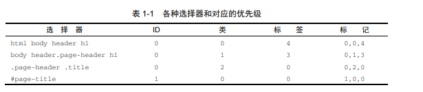
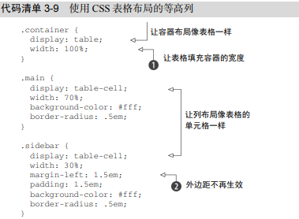
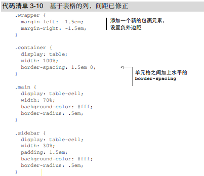
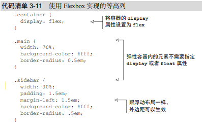
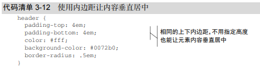
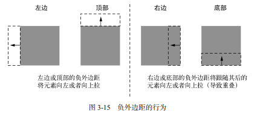
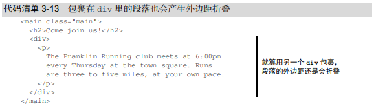

[toc]

# 1. 层叠、优先级和继承

## 1.1 层叠

CSS本质上就是声明规则。CSS开发很重要的一点就是以可预测的方式书写规则。
层叠指的是一系列规则。它决定了如何解决冲突，是CSS语言的基础。  

当声明冲突时，层叠会根据三种条件解决冲突：
1. 样式表的来源 
   样式是从哪里来的，包括你的样式和浏览器默认样式
2. 选择器优先级 
   哪些选择器比另一些选择器更重要
3. 源码顺序 
   样式在样式表里的声明顺序

规则概括图表，展示了声明的优先顺序：
  

~~~
术语解释
以下是CSS中的一行。它被称作一个声明。该声明由一个属性（color)和一个值（black)组成。
    color: black;
包含在大括号内的一组声明被称作一个声明块。声明块前面有一个选择器(如下面的body)
    body {
        color: black;
        font-family: Helvetica;
    }
选择器和声明块一起组成了规则集（ruleset)。一个规则集也简称一个规则（rule），但更多人用复数（rules)来指一系列样式的集合。

最后，@规则(at-rules)是指用“@”符号开头的语法。比如@import规则或者@media查询。
~~~

### 1.1.1 样式表的来源

你添加到网页里的样式表并不是浏览器唯一使用的样式表，还有其它类型或者来源的样式表。

你的样式表属于**作者样式表**，除此之外还有用户代理样式表，即浏览器默认样式。用户代理样式表优先级低，你的样式会覆盖它们。

说明： 有些浏览器允许用户定义一个用户样式表。这是第三种来源，它的优先级介于用户代理样式表和作者样式表之间。用户样式表很少见，并且不受网站作者控制。  

用户代理样式在不同浏览器上稍有差异，但大体上做相同的事情：为标题（从h1到h6）和段落(p)添加上下外边距，为列表（ol或者ul)添加左侧内边距，为链接添加颜色，为元素设置各种默认字号  

1. 用户代理样式  
  浏览器应用了用户代理样式后才会应用你的样式表，即作者样式表。你指定的声明会覆盖用户代理样式表里的样式。如果你在HTML里面链接了多个样式表，那么它们的来源都相同，即作者。  
2. !imporrtant声明  
  样式来源规则有一个例外：标记为important的声明。  
    color: red !important;
  标记了!important的声明会被当做更高优先级的来源，因此总体的优先级按照由高到底排列如下所示：  
    + 作者的!important  
    + 作者  
    + 用户代理  

层叠独立地解决了网页中每个元素的样式属性的冲突。

### 1.1.2 理解优先级

如果无法用来源解决冲突声明，浏览器会尝试检查它们的优先级。理解优先级很重要。

浏览器将优先级分为两个部分：HTML的行内样式和选择器的样式  
1. 行内样式
    如果用HTMl的style属性写样式，这个声明只会作用于当前元素。实际上行内元素属于“带作用域”的声明，它会覆盖任何来自样式表或者<style>标签的样式。行内样式没有选择器，因为它们直接作用于所在的元素。  
    为了在样式表里覆盖行内声明，需要为声明添加!important,这样能将它提升到一个更高优先级的来源。但如果行内样式也被标记为!important，就无法覆盖它了。最好是只在样式表中使用!important.  
2. 选择器优先级  
    优先级的第二部分由选择器决定。比如，有两个类名的选择器比只有一个类名的选择器优先级更高。但选择器的长度并不是决定优先级的唯一因素。  
    不同类型的选择器有不同的优先级。比如：ID选择器比类选择器优先级更高。实际上,ID选择器的优先级比拥有任意多个类的选择器都高。同理：类选择器的优先级比标签选择器更高。    
    优先级的准确规则如下：  
    + 如果选择器的ID数量更多，则它会胜出（即它更明确）  
    + 如果ID数量一致，那么拥有最多类的选择器胜出  
    + 如果以上两次比较都一致，（但不要把它们加到你的网页中），它们是按照优先级由低到高的顺序排列的。   

    说明：伪类选择器（如：hover)和属性选择器(如[type="input"])与一个类选择器的优先级相同。通用选择器（*）和组合选择器（>、+、-）对优先级没有影响。  
    
    如果你在CSS里写了一个声明，但是没有生效，一般是因为被更高优先级的规则覆盖了。ID选择器会创建更高的优先级，之后被覆盖。如果要覆盖一个ID选择器的样式，就必须用另一个ID选择器。
3. 优先级标记
    一个常用的表示优先级的方式是用数值方式来标记，通常用逗号隔开每个数，比如"1,2,2"表示选择器由1个ID、2个类、2个标签组成。优先级最高的ID列为第一位，紧接着是类，最后是标签。
      
    现在通过比较数值就能决定哪个选择器优先级更高。"1,0,0"的优先级高于"0,2,2"、"0,10,0",因为第一个数（ID)有最高优先级。  
    有时，人们还会用4个数的标记，其中将最重要的位置用0或1来表示，代表一个声明是否是用行内样式添加的。此时，行内样式的优先级为（1,0,0,0)。它会覆盖通过选择器添加的样式，比如"0,1,2,0"的选择器。  
4. 关于优先级的思考  
   !important注释将声明提升到了更高优先级的来源。这个方法很简单，也很低级。当给一个些声明加上!important时，就会先比较来源，再使用常规的优先级规则。最终会让一切回到起点：一旦引入一个!important，就会带来更多的!important  
   更好的方法是：不要绕开选择器的优先级，而是利用它来解决问题。  
   通常最好让优先级尽可能低，这样当需要覆盖一些样式时，才能有选择空间。

### 1.1.3 源码顺序

层叠的最后一步，是源码顺序。如果两个声明的来源和优先级相同，其中一个声明在样式表中出现较晚，或者位于页面较晚引入的样式表中，则该声明胜出。  

面对一个样式问题时，可以分两个步骤来解决：
+ 确定哪些声明可以实现效果
+ 思考可以用哪些选择器结构，然后选择最符合需求的那个  
  
1. 链接样式和源码顺序
   书写顺序之所以很重要，就是因为层叠。
2. 层叠值
   浏览器遵循三个步骤，即来源、优先级、源码顺序，来解析网页上的每个元素的每个属性。如果一个声明在层叠中“胜出”，它就被称作一个**层叠值**。  
   元素的每个属性最多只有一个层叠值。  
   层叠值 - 作为层叠结果，应用到一个元素上的特定属性的值。

### 1.1.4 两条经验法则

1. 在选择器中不要使用ID
2. 不要使用!important
   
这两条规则是很好的建议，但不必固守它们，因为也有例外。

## 1.2 继承

最后一个给元素添加样式的方式是：继承。  
如果一个元素的某个属性没有层叠值，则可能会继承某个祖先元素的值。  
不是所有的属性都能被继承。默认情况下，只有特定的一些属性能被继承，通常是我们希望被继承的哪些。它们主要是跟文本先关的属性：color font font-family font-size font-weight font-variant font-style line-height letter-spacing text-align text-indent text-transform white-space word-spacing  
还有一些其它的属性也可以被继承，比如列表属性：list-style list-style-type list-style-position以及list-style-image。表格的边框属性border-collapse和border-spacing也能被继承。注意：这些属性控制的是表格的边框行为，而不是常用于指定非表格元素边框的属性。

## 1.3 特殊值 

有两个特殊值可以赋给任意属性，用于控制层叠：inherit和initial  

### 1.3.1 使用inherit关键字

当想用继承代替一个层叠值，就可以用inherit关键字。可以用它来覆盖另一个值，这样该元素就会继承其父元素的值。

### 1.3.2 使用initial关键字

当需要撤销作用于某个元素的样式。这可以用initial关键字来实现。  
每一个CSS属性都有初始（默认）值。如果将initial值赋给某个属性，那么就会有效地将其重置为默认值，这种操作相当于硬复位了该值。  
auto不是所有属性的默认值，对很多属性来说甚至不是合法的值。  

说明：声明display: initial等价于display:inline。不管应用关于哪种类型的元素，它都不会等于display:block。 这是因为initial重置为属性的初始值，而不是元素的初始值。inline才是display属性的初始值。

## 1.4 简写属性

简写属性是用于同时给多个属性赋值的属性。比如font是一个简写属性，可以用于设置多种字体属性。它指定了font-style、font-weight、font-size、font-height以及font-family。  
还有如下属性：
+ background  
  多个背景属性的简写：background-color、background-image、background-size、background-repeat、background-position、background-origin、background-chip以及background-attachment  
+ border  
  border-width、border-style以及border-color的简写属性，而这几个属性也都是简写属性
+ border-width  
  上、右、下、左四个边框宽度的简写属性

### 1.4.1 简写属性会默默覆盖其它样式

大多数简写属性可以省略一些值，只指定我们关注的值。但是要知道，这样仍然会设置省略的值，即它们会被隐式地设置为初始值。这会默默覆盖其它地方定义的样式。

### 1.4.2 理解简写值的顺序

简写属性会尽量包含指定的属性值的顺序。可以设置border: 1px solid black 或者 border: black 1px solid，两者都会生效。这是因为浏览器知道宽度、颜色、边框样式分别对应什么类型的值。  

但是有很多属性的值很模糊。在这种情况下，值的顺序很关键。  
1. 上 右 下 左 
   当遇到像margin、padding这样的属性，还有为元素的四条边分别指定值的边框属性时，开发者容易弄错这些简写属性的顺序。这些属性的值都是按照顺时针方向，从上边开始的。   
2. 水平、垂直  
   还有一些属性只支持最多指定两个值，这些属性包括background-position、box-shadow、text-shadow(虽然严格来说它们并不是简写属性)。这些属性值的顺序跟padding这种四值属性的顺序正好相反，比如,padding：1em 2em先指定了垂直方向上的上下属性值，然后才是水平方向的右、左属性值。而 background-position:25%   75%则先指定水平方向的右/左属性值，然后才是垂直方向的上/下属性值。  
   虽然看起来顺序相反的定义违背了直觉，原因却很简单：这两个值代表了一个笛卡尔网格。笛卡尔网格的测量值一般是按照x,y(水平、垂直)的顺序来的。

## 1.5 总结
   + 控制选择器的优先级
   + 不要混淆层叠和继承
   + 某些属性会被继承，包括文本、列表、表格边框相关的属性
   + 不要混淆initial和auto值
   + 简写属性要注意TRouBLe的顺序，避免踩坑

# 2. 相对单位

&emsp;像素(px)是绝对单位。em和rem,是相对单位。相对单位的值会根据外部因素发生变化。

## 2.1 相对值的好处

CSS为网页带来了后期绑定(late-binding)的样式：直到内容和样式都完成了，二者才会结合起来。

### 2.1.1 那些年追求的像素级完美

&emsp;&emsp;在Web环境下，用户可以设置浏览器窗口的大小，而CSS必须适应这种窗口大小。此外，当网页打开后，用户还可以缩放网页，CSS还需要适应新的限制。也就是说，不能在刚创建网页时就应用样式，而是等到要将网页渲染到屏幕上时，才能去计算样式。  
&emsp;&emsp;这给CSS增加了一个抽象层。我们无法根据理想的条件给元素添加样式，而是要设置无论元素处于任意条件，都能够生效的规则。现在的web环境下，网页需要既可以在4英寸的手机屏幕上渲染，也可以在30英寸的大屏幕上渲染。  
&emsp;&emsp;在很长时间内，网页设计者通过“像素级完美”的设计来降低这种复杂性。它们会创建一个紧凑的容器，通常是居中的一栏，大约800px宽。然后再像之前的本地应用程序或者印刷出版物那样，在这些限制里面进行设计。

### 2.1.2 像素级完美的时代终结了

随着技术的发展，加上制造商推出高清显示器，像素级完美的方式逐渐走向了终点。在21世纪初，大家开始讨论是否可以安全地将网页宽度设计为1024px，而不是800px。随后人们又开始讨论是否要将网页宽度设计为1280px。当时我们得做出选择：到底是让网页宽于旧计算机，还是窄于新计算机。  
等到智能手机出现后，人们再也无法假设每个用户访问网站的体验都能一样。无论如何，都得抛弃那种固定宽度的栏目设计，开始考虑响应式设计。我们无法逃避CSS带来的抽象性。我们得拥抱它。

响应式：在CSS中指的是样式能够根据浏览器窗口的大小有不同的“响应”。这要求有意地考虑任何尺寸的手机、平板设备，或者桌面屏幕。  

相对单位就是CSS用来解决此类问题的一种工具。我们可以基于窗口大小来等比例地缩放字号，而不是固定为14px，或者将网页上的任何元素的大小都相对于基础字号来设置，然后只用改一行代码就能缩放整个网页。

~~~
像素、点、派卡

CSS支持几种绝对长度单位，最常用、最基础的是像素（px)。不常用的绝对单位是mm（毫米）、cm(厘米)、in(英寸)、pt(点，印刷术语，1/72英寸)、pc(派卡，印刷术语，12点)。这些单位都可以通过公式互相换算：1in = 25.4mm = 2.54cm = 6pc = 72pt = 96px
~~~

## 2.2 em 和 rem

em是最常见的相对长度单位，适合基于特定的字号进行排版。在CSS中，1em等于当前元素的字号，其准确值取决于作用的元素。  

浏览器会根据相对单位的值计算出绝对值，称作计算值（computed value)

当设置padding、height、width、border-radius等属性时，使用em会很方便，因为当元素继承了不同的字号，或者用户改变了字体设置时，这些属性会跟着元素均匀地缩放

### 2.2.1 使用 em 定义字号

当前元素的字号决定了em。但如果声明font-size：1.2em，那么font-size是根据继承的字号来计算的

对于大多数浏览器来说，默认的字号是16px。准确来说，medium关键字的值是16px


### 2.2.2 使用 rem 设置字号

## 2.3 停止像素思维

## 2.4 视口的相对单位

## 2.5 无单位的数值和行高

## 2.6 自定义属性

## 2.7 总结

# 3. 盒模型

> 本章概要
>     给元素设置大小的实用经验
>     实现垂直居中
>     实现等高列
>     负外边距和外边距折叠
>     网页组件之间一致的间距

## 3.1 元素宽度的问题

避免魔术数值（通过样式试出来的值），让浏览器帮忙计算（calc）

CSS中使用box-sizing属性调整盒模型的行为：
   content-box，属性默认值，指定的宽和高只会设置内容盒子的大小
   border-box,指定的宽和高会设置内容、内边距、边框的大小总和

全局设置border-box
   1. 普遍做法
      ```css
      *,
      ::before,
      ::after {
         box-sizing: border-box;
      }
      ```
   2. 其它做法
      如果网页中使用了带样式的第三方组件，可能会因此破快其中一些组件的布局。
      ```css
      :root {
         box-sizing: border-box;
      }

      *,
      ::before,
      ::after {
         box-sizing: inherit;
      }
      ```
      盒模型通常不太会被继承，但是使用inherit关键字可以强制继承。

## 3.2 元素高度的问题

处理元素高度的方式跟处理宽度不一样。之前对border-box的修改依然适用于高度，但通常最好避免给元素指定明确的高度。**普通文档是为限定的宽度和无限的高度设计的。** 内容会填满视口的宽度，然后在必要的时候折行。因此，**容器的高度由内容天然地决定，而不是容器自己决定**

```
普通文档流：指的是网页元素的默认布局行为。行内元素跟随文字的方向从左到右排列，当到达容器边缘时会换行。块级元素会占据完整的一行，前后都有换行。
```

### 3.2.1 控制溢出行为

当明确设置一个元素的高度时，内容可能会溢出容器。当内容在限定的区域放不下，渲染到父元素外面时，就会发生这种现象
CSS中**overflow**属性可以控制溢出内容的行为，该属性支持以下4个值：
1. visible(default)
   所有内容可见，即使溢出容器边缘
2. hidden
   溢出容器内边距边缘的内容被裁剪，无法看见
3. scroll 
   容器出现滚动条。在一些OS上，会出现水平和垂直两种滚动条，即使所有内容都不溢出。不过，这种情况下滚动条不可滚动
4. auto 
   只有内容溢出时才会出现滚动条

请谨慎使用滚动条。浏览器给网页最外层加上了滚动条，如果网页内部再嵌套滚动区域，用户就会很反感。

```
水平方向的溢出
  除了垂直溢出，内容也可能在水平方向溢出。
  可以用overflow-x属性单独控制水平方向的溢出，或者用overflow-y控制垂直方向溢出。这些属性支持overflow的所有值，然后同时给x和y指定不同的值，往往会产生难以预料的结果。
```

### 3.2.2 百分比高度的备选方案

**用百分比指定高度存在问题。** 百分比参考的是元素容器块的大小，但是容器的高度通常是由子元素的高度决定的。这样就会造成死循环，浏览器处理不了就会忽略这个声明。要想让百分比高度生效，必须给父元素明确定义一个高度

大家使用百分比高度的目的是想让容器填满屏幕。更好的方式是使用视口的相对单位vh。100vh等于视口的高度。还有一个更常见的用法是创建等高列。

1. 等高列
   **现代浏览器**是指能够自动更新（长青）的浏览器的最近版本
   让列自己决定高度，然后扩展较矮的列，让它的高度等于较高的列，可以用CSS表格和flexbox实现
2. CSS表格布局
   
   默认情况下，display为table的元素的宽度不会扩展到100%，因此需要明确指定宽度。外边距不会作用于table-cell元素，因此需要修改代码让间隔生效
   可以用表格元素的border-spacing来定义单元格的间距。该属性接受两个长度值：水平间距和垂直间距。这会产生副作用：这个值也会作用于表格的外边距，这样两列就无法跟头部左右对齐了
   
   正的外边距会将容器的边缘往里推，而负的外边距会将边缘往外拉。结合border-spacing,两列靠近外侧的边缘跟包裹元素所在的容器盒子的边缘对齐了，实现了等高列，1.5em间距，外边缘与头部对齐
3. Flexbox
   可以使用flexbox实现等高列。它不需要额外的包裹元素，它默认产生等高的元素。此外也不需要负外边距
   
   给容器设置display:flex，它就变成了**弹性容器**，子元素默认等高。可以给子元素设置宽度和外边距，尽管加起来可能超过100%，flexbox也能妥善处理
   > 警告 除非别无选择，否则不要明确设置元素的高度

### 3.2.3 使用min-height和max-height

min-height和max-height是两个比较有用的属性。可以用它们指定最小或最大值，而不是明确定义高度，这样元素就可以在这些界限内自动决定高度。
此外，还有类似的属性min-width和max-width,用于限制元素的宽度

### 3.2.4 垂直居中内容

在实现这种效果时，请尽量交给浏览器来决定高度
vertical-align声明只会影响行内元素或者table-cell元素
CSS中最简单的垂直居中方法是给容器相等的上下内边距，让容器和内容自行决定自己的高度

不管容器里的内容显示为行内、块级或者其它形式，这种方法都有效。
<center>垂直居中指南</center>
- 可以用一个自然高度的容器吗？
  给容器加上相等的上下内边距让内容居中
- 容器需要指定高度或者避免使用内边距吗？
  对容器使用display:table-cell和vertical-align:middle
- 可以用Flexbox吗？
  如果不需要支持IE9，可以用flexbox居中内容
- 容器里面的内容只有一行文字吗？
  设置一个大的行高，让它等于理想的容器高度。这样会让容器高度扩展到能够容纳行高。如果内容不是行内元素，可以设置为inline-block
- 容器和内容的高度都知道吗？
  将内容绝对定位
- 不知道内容元素的高度？
  用绝对定位结合变形

## 3.3 负外边距

不同于内边距和边框宽度，外边距可以设置为负值。负外边距有一些特殊用途，比如让元素重叠或者拉伸到比容器还宽。
负外边距的具体行为取决于设置在元素的哪边。如果设置在左边或顶部，元素就会相应的向左或者向上移动，导致元素与它前面的元素重叠；如果设置在右边或底部，并不会移动元素，而是将它后面的元素拉过来。给元素底部加上负外边框并不等于给它下面的元素顶部加上负外边距。

> 警告 如果元素被别的元素遮挡，利用负外边距让元素重叠的做法可能导致元素不可点击

## 3.4 外边距折叠

当顶部和底部的外边距相邻时，就会重叠，产生单个外边距。这种现象被称为**折叠**

### 3.4.1 文字折叠

外边距折叠的主要原因与包含文字的块之间的间隔有关。段落<p>默认有1em的上外边距和下外边距。这是用户代理的样式表添加的，但当前后叠放两个段落时，它们的外边距不会相加产生一个2em的间隔，而会折叠，只产生1em的间隔
折叠外边距的大小等于相邻外边距的最大值

### 3.4.2 多个外边距折叠

即使两个元素不是相邻的兄弟节点也会产生外边距折叠。即使这个段落用一个额外的div包括起来

三个外边距折叠：<h2>底部的外边距、<div>顶部的外边距、<p>顶部的外边距。计算值分别是19.92px、0px、16px。因此最终间隔还是19.92px，也就是三者中的最大值。实际上，即使将段落放在多个div中嵌套，渲染结果都一样：所有外边距都回折叠到一起。
总之，所有相邻的顶部和底部外边距会折叠到一起。
> 只有上下外边距会产生折叠，左右外边距不会折叠

### 3.4.3 容器外部折叠

弹性子元素的外边距不会折叠
给头部添加上下内边距，外边距就不会在容器外部折叠
```css
header {
   padding: 1em 1.5em;
   color: #fff;
   background-color: #0072b0;
   border-radius: .5em;

}
```
如下方法可以防止外边距折叠
- 对容器使用overflow:auto(或者非visible的值)，防止内部元素的外边距跟容器外部的外边距折叠。这种方式副作用最小。
- 在两个外边距之间加上边框或者内边距，防止它们折叠
- 如果容器为浮动元素、内联块、绝对定位或固定定位时，外边距不会在它外面折叠
- 当时用flexbox布局时，弹性布局内的元素之间不会发生外边距折叠，网格布局同理
- 当元素显示为table-cell时不具备外边距属性，因此它们不会折叠。此外还有table-row和大部分其它表格显示类型，但不包括table、table-inline、table-caption

## 3.5 容器内的元素间距

猫头鹰选择器 * + * 会选中页面上有着相同父级的非第一个子元素
```css
body * + * {
   margin-top: 1.5em;
}
```
以上代码在全局范围内处理了大多数元素的间距问题。它省去许多需要设置外边距的地方，但在不想加外边距的地方则需要覆盖。通常只在有并列元素，或者有多列布局时这样使用

## 3.6 总结
- [ ] 总是全局设置border-box，以便得到预期的元素大小
- [ ] 避免明确设置元素高度，以免出现溢出现象
- [ ] 使用现代布局技术（如display: table或者flexbox）实现列等高或垂直居中内容
- [ ] 如果外边距行为很奇怪，就采取措施防止外边距折叠
- [ ] 使用猫头鹰选择器全局设置堆叠元素之间的外边距


# 第二部分 精通布局

# 4. 理解浮动

> 本章概要
>     浮动的工作原理，以及如何避开常见的陷阱
>     容器折叠和清除浮动
>     媒体对象和双容器模式
>     块级格式化上下文
>     如何创建和理解一个网格系统

最重要的三种改变文档流的方式：浮动、Flexbox和网格布局
定位的主要作用是将元素堆叠到其它元素之上

## 4.1 浮动的设计初衷

**浮动**能将一个元素（通常是一张图片）拉到其容器的一侧，这样文档流就能够包围它。
浮动元素会被移出正常文档流，并被拉到容器边缘。文档流会重新排列，但是它会包围浮动元素此刻所占据的空间。

> 最简单的方式是先将网页的大块区域布局好，再逐级布局内部的小元素
在开始浮动元素之前，要先将网页的外层结构样式写好

- 双容器模式
  ```css
   .container {
      max-width: 1080px;
      margin: 0 auto;
   }
  ```
这种布局常用于将网页内容居中。通过将内容放置到两个嵌套的容器中，然后给内层的容器设置外边距，让它在外层容器中居中

4.2 容器折叠和清除浮动


   


 


