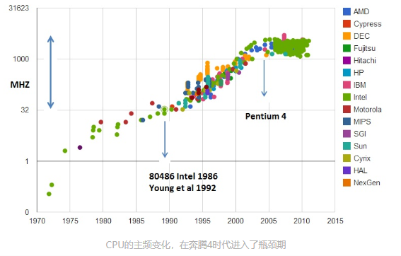

[toc]

# 00 | 为什么要学习组成原理

硬件和软件之前需要一座桥梁，而“计算机组成原理”就扮演了这个角色，它既隔离了软件和硬件，也提供了让软件无需关心硬件，就能直接操作硬件的接口。

组成原理是计算机其它核心课程的一个“导引”。学习组成原理之后，向下，你可以学习数字电路相关的课程，向上，你可以学习编译原理、操作系统这些核心课程。


奔腾 4 的失败，是受限于超长流水线带来的散热和功耗问题。
移动时代 ARM 的崛起，则是因为 Intel 的芯片功耗太大，不足以在小小的手机里放下足够支撑 1 天的电池。
计算机芯片的兴盛和衰亡，往往都是因为我们的计算机遇到了“功耗墙”这个散热和能耗上的挑战。而现代的云计算数据中心的设计到选址，也是围绕功耗和散热的。

# 01 | 冯.诺依曼体系结构：计算机组成金字塔

## 计算机的基本硬件组成-早年

早年，要组装一台计算机，要先有三大件，CPU、内存、主板

- CPU  
  计算机最重要的核心配件，全名为“中央处理器（Central Processing Unit)”。说它最重要，是因为计算机所有的计算都是由 CPU 来进行的。
- 内存  
  撰写的程序、打开的浏览器、运行的游戏，都要加载到内存里才能运行。程序读取的数据、计算得到的结果，也都要放在内存里。内存越大，能加载的东西就越多。
  存放在内存里的程序和数据，需要被 CPU 读取，CPU 计算完之后，还要把数据写回到内存。然而 CPU 不能直接插到内存上，反之亦然。于是，就引入了最后一个大件-主板（Motherboard）
- 主板  
  主板是一个有着各种各样，有时多达数十乃至上百插槽的配件。我们的 CPU 要插在主板上，内存也要插在主板上。主板的芯片组（Chipset)和总线（BUS）解决了 CPU 和内存之间的通信问题。芯片组控制了数据传输的流转，也就是数据从哪里到哪里的问题。总线则是实际数据传输的高速公路。因此，总线速度（BUS Speed)决定了数据能传输的多快。

其它配件

- 输入/输出设备（I/O 设备）  
  键盘、鼠标、显示器
- 存储设备  
  硬盘，持久保存数据
- 显卡  
  现在的主板都内置显卡。显卡里有处理 CPU 之外的另一个“处理器”，也就是 GPU（Graphics Processing Unit，图形处理器），GPU 一样可以做各种“计算”工作
- 机箱风扇等  
  解决灰尘和散热问题，不是计算机必备硬件

鼠标、键盘和硬盘，这些都是插在主板上的。作为外部 I/O 设备，它们都是通过主板上的南桥（SouthBridge)芯片组，来控制和 CPU 之间的通信的。“南桥”芯片的名字很直观，一方面，它在主板的位置，通常是在主板的“南面”。另一方面，它的作用就是作为“桥”，来连接鼠标键盘硬盘这些外部设备和 CPU 之间的通信。

有南桥，自然也有北桥。以前的主板上通常有“北桥”芯片，用来作为“桥”，连接 CPU 和内存、显卡之间的通信。不过随时间变迁，现在的主板上“北桥”芯片的工作，已经被移到了 CPU 内部，所以在主板上已经看不到北桥芯片了

## 冯.诺依曼体系结构

我们手机里只有 SD 卡（Secure Digital Memory Card)这样类似硬盘功能的存储卡插槽，并没有内存插槽、CPU 插槽这些东西。没错，因为手机尺寸的原因，手机制造商们选择把 CPU、内存、网络通信、乃至摄像头芯片，都封装在一个芯片里，然后再嵌入到手机主板上。这种方式叫做 SoC，也就是 System on a Chip（系统芯片）
如此看来，个人 PC 和智能手机的硬件组成方式似乎不太一样。可是我们写智能手机上的 APP，和写电脑的客户端应用似乎并无差别，都是通过“高级语言”这样的编程语言撰写、编译之后，一样是把代码和数据加载到内存里执行。这是为什么呢？因为，无论是个人电脑、服务器、智能手机，还是 Raspberry Pi 这样的微型卡片机，都遵循着同一个“计算机”的抽象概念。也就是冯\*诺依曼体系结构（Von Neumann architecture), 也叫存储程序计算机。

什么是存储程序计算机呢？这里面其实暗含了两个概念，一个是“可编程”计算机，一个是“存储”计算机。

- 不可编程  
  计算机是由各种门电路组合而成，然后通过组装出一个固定的电路板，来完成一个特定的计算程序。一旦需要修改功能，就要重新组装电路。这样的话，计算机就是“不可编程”的，因为程序设计在计算机硬件层面是“写死”的。最常见的就是老式计算器，电路板设好了加减乘除，做不了任何计算逻辑固定之外的事情
- 不可存储  
  程序本身是存储在计算机的内存里，可以通过加载不同的程序来解决不同的问题。有“存储程序计算机”，自然也有不能存储程序的计算机。典型的就是早年的“Plugboard”这样的插线板式计算机。整个计算机就是一个巨大的插线板，通过板子上不同的插头或者接口的位置插入线路，来实现不同的功能。这样的计算机自然是“可编程”的，但是编写好的程序不能存储下来供下一次加载使用，不得不每次要用到和当前不同的“程序”的时候，重新插板子，重新“编程”。

Firt Draft
第一份草案中说了一台计算机的组成

- 处理器单元-Processing Unit  
  处理器单元包含算术逻辑单元（Arithmetic Logic Unit， ALU)和处理器寄存器（Processor Register)，用来完成各种算术和逻辑运算。因为它能够完成各种数据的处理或者计算工作，因此也有人把这个叫做数据通路（Datapath)或者运算器
- 控制器单元-Control Unit/CU  
  控制器单元包含指令寄存器（Instruction Register）和程序计数器（Program Counter),用来控制程序的流程，通常是不同条件下的分支和跳转。在现在的计算机中，上面的算术逻辑单元和这里的控制器单元，共同组成了我们的 CPU
- 内存、外部存储  
  内存用来存储数据（data）和指令（instruction）。外部存储拥有更大容量，在过去可能是磁带、磁鼓这样的设备，现在通常是硬盘
- 输入输出设备  
  最后是各种输入输出设备，以及对应的输入和输出机制。我们现在无论是使用什么样的计算机，其实都是和输入输出设备在打交道。个人 PC 的鼠标键盘是输入设备，显示器是输出设备。智能手机触摸屏既是输入设备，又是输出设备。而跑在各种云上的服务器，则是通过网络来进行输入和输出。这个时候，网卡就是输入设备又是输出设备。

任何一台计算机的任何一个部件都可以归到运算器、控制器、存储器、输入设备和输出设备中，而所有的现代计算机也都是基于这个基础架构来设计开发的。

而所有的计算机程序，也都可以抽象为从输入设备读取输入信息，通过运算器和控制器来执行存储在存储器里的程序，最终把结果输出到输出设备中。而我们所有撰写的无论高级还是低级语言的程序，也都是基于这样一个抽象架构来进行运作的。


## 总结延伸

冯诺依曼体系结构确立了我们现在每天使用的计算机硬件的基础架构。
学习组成原理，其实就是学习控制器、运算器的工作原理，也就是 CPU 是怎么工作的，以及为何这么设计；学习内存的工作原理，从最基本的电路，到上层抽象给到 CPU 乃至应用程序的接口是怎样的；学习 CPU 是怎么和输入输出设备打交道的

学习组成原理，就是在理解从控制器、运算器、存储器、输入及输出设备，从电路这样的硬件，到最终开放给软件的接口，是怎么运作的，为什么要设计成这样，以及在软件开发层面怎么尽可能用好它

## 课后思考

图灵机

# 02 | 知识地图，计算机组成原理应该这么学


由上图看出：整个计算机组成原理，就是围绕计算机是如何组织运作展开的

## 计算机组成原理知识地图

图中把整个计算机组成原理的知识点拆分为四大部分，分别是计算机的基本组成、计算机的指令和计算、处理器设计以及存储器和 I/O 设备

### 计算机的基本组成

这一部分，需要学习计算机是由哪些硬件组成的。这些硬件如何对应到冯诺依曼体系结构，也就是运算器、控制器、存储器、输入设备和输出设备这五大基本组件。
除此之外，还需了解计算机的两大核心指标：性能和功耗

### 计算机的指令和计算

本部分，需要搞明白，我们每天撰写的一行行 C、Java、PHP 程序，是怎么在计算机里跑起来的。这里，你既需要了解程序是怎么通过编译器和汇编器，变成一条条机器指令这样的编译过程，还需要知道操作系统是怎么链接、装载、执行这些程序的。而这一条条指令执行的控制台过程，就是由控制器来控制的。

在计算机的计算部分，要从二进制和编码开始，理解我们的数据在计算机里的表示，以及我们是怎么从数字电路层面，实现加法、乘法这些基本的运算功能的。实现这些运算功能的 ALU（Arithmetic Logic Unit/ALU)，也就是算术逻辑单元，其实就是运算器。

另一个特别重要的知识点，就是浮点数（Floating Point).浮点数是日常运用中非常容易用错的一种数据表示形式。掌握浮点数能让你对数据的编码、存储和计算能够有一个从表到里的深入理解。尤其是在 AI 火热的今天，浮点数是机器学习中重度使用的数据表示形式，掌握它非常有必要

### CPU 的设计

CPU 时钟可以用来构造寄存器和内存的锁存器和触发器，因此，CPU 时钟应该是我们学习 CPU 的前导知识。搞明白我们为什么需要 CPU 时钟，以及寄存器和内存是用什么样的硬件组成的之后，我们可以再来看看，整个计算机的数据通路是如何构造出来的

数据通路，其实就是连接了整个运算器和控制器，并最终组成了 CPU。出于对性能和功耗的考虑，你要进一步理解和掌握面向流水线设计的 CPU、数据和控制冒险，以及分支预测的相关技术

既然 CPU 作为控制器要和输入输出设备通信，那么我们就要知道异常和中断发生的机制。在 CPU 设计部分的最后，了解下并行执行，看看如何直接在 CPU 层面，通过 SIMD 来支持并行计算

### 存储器原理

通过存储器的层次结果作为基础的框架引导，掌握从上到下的 CPU 高速缓存、内存、SSD 硬盘和机械硬盘的工作原理，它们之间的性能差异，以及实际应用中利用这些设备会遇到的挑战。存储器其实很多时候又扮演了输入输出设备的角色，所以需要进一步了解，CPU 和这些存储器之间是如何进行通信的。以及我们最重视的性能问题是怎么回事；理解什么是 IO_WAIT,如何通过 DMA 来提升程序性能

对于存储器，我们不仅需要它们能够正常工作，还要确保里面的数据不能丢失。故还要掌握我们是如何通过 RAID、Erasure Code、ECC 以及分布式 HDFS，这些不同的技术，来确保数据的完整性和访问性能

# 03 | 通过 CPU 主频，我们来谈谈“性能”究竟是什么？

在计算机组成原理乃至体系结构中，“性能”都是最重要的一个主题。学习和研究计算机组成原理，就是理解计算机是怎么运作的，以及为什么要这么运作。“为什么”所要解决的事情，很多时候就是提升性能。

## 什么是性能？时间的倒数

对于计算机的性能，有衡量标准。这个标准中主要有两个指标

- 响应时间  
  响应时间（response time)或者叫执行时间（Execution time)。提升这个指标，意欲让计算机“跑的更快”
- 吞吐率  
  吞吐率（throughput）或者带宽（bandwidth)。提升这个指标，意欲让计算机“搬得更多”

所以说，响应时间指：我们执行一个程序，到底需要花多少时间。花的时间越少，自然性能就越好。  
而吞吐率是指我们在一定的时间范围内，到底能处理多少事情。这里的“事情”，在计算机里就是处理的数据或者执行的程序指令

我们一般把性能，定义为响应时间的倒数：  
 性能 = 1 / 响应时间

## 计算机的计时单位：CPU 时钟

时间是一个很自然的用来衡量性能的指标，但是用时间来衡量，有两个问题

### 时间不“准”

为什么会不准？首先，我们统计时间是用类似于掐秒表一样，记录程序运行结束的时间减去程序开始运行的时间。这个时间也叫 Wall Clock Time 或者 Elapsed Time,就是在运行程序期间，挂在墙上的钟走掉的时间。

但是计算机可能同时运行着多个程序，CPU 实际上不停地在各个程序之间进行切换。在这些走掉的时间里，很可能 CPU 切换去运行别的程序的。而且，有些程序在运行的时候，可能要从网络、硬盘去读取数据，要等网络和硬盘把数据读出来，给到内存和 CPU。所以说，_要想准确统计某个程序运行时间，进而去比较两个程序的实际性能，就得把这些时间给刨除掉_

Linux 系统下有个叫 time 的命令，可以帮我们统计，同样的 Wall Clock Time 下，程序实际在 CPU 上到底花了多长时间。运行 time 命令，会返回三个值：

- real time  
  wall clock time，也就是运行程序整个过程中流逝掉的时间
- user time  
  CPU 在运行你的程序，在用户态运行指令的时间
- sys time
  CPU 在运行你的程序，在操作系统内核里运行指令的时间

而程序实际花费的 CPU 执行时间(CPU Time),就是 user time 加上 sys time

```
$ time seq 1000000 | wc -l
1000000


real  0m0.101s
user  0m0.031s
sys   0m0.016s
```

备注：最好在云平台上，找一台 1CPU 的机器来跑这个命令，在多 CPU 的机器上，seq 和 wc 两个命令可能分配到不同的 CPU 上，我们拿到的 user time 和 sys time 是两个 CPU 上花费的时间之和，可能会导致 real time 可能会小于 user time + sys time

### 即使拿到 CPU 时间，也未必能直接“比较”出两个程序的性能差异

即使在同一台计算机上，CPU 也可能满载运行也可能降频运行，降频运行的时候花的时间会多一些。

除了 CPU 之外，时间这个性能指标还会受到主板、内存这些其它相关硬件的影响。所以我们需要对“时间”指标进行拆解，把程序的 CPU 执行时间变成 CPU 时钟周期数(CPU Cycles)和时钟周期时间(Clock Cycle)的乘积：  
 程序的 CPU 执行时间 = CPU 时钟周期数 X 时钟周期时间

什么是时钟周期时间？
CPU 的主频，例如 Intel Core-i7-7700hQ 2.8GHZ，这里的 2.8GHZ 就是电脑的主频（Frequency/Clock Rate)。这个 2.8GHZ，我们可以认为是，CPU 在 1 秒时间内，可以执行简单指令的数量为 2.8G 条

更准确一点，2.8GHZ 表示，CPU 的一个“钟表”能够识别出来的最小时间间隔。

在 CPU 内部，有一个叫晶体振荡器(Oscillator Crystal)的东西，称为晶振。我们把晶振当成 CPU 内部的电子表来使用。晶振带来的每一次“滴答”，就是时钟周期时间。

在 2.8GHZ 的 CPU 上，时钟周期时间就是 1/2.8G。CPU 是按照这个“时钟”提示的时间来进行自己的操作。主频越高，意味着这个表走的越快，我们的 CPU 也就被逼着走的越快（CPU 跑的越快，散热的压力也就越大）

对于 CPU 时钟周期数，我们可以再做一个分解，把它变成“指令数 X 每条指令的平均时钟周期数（Cycles Per Instruction,简称 CPI)”。不同的指令需要的 Cycles 是不同的，加法和乘法都应对着一条 CPU 指令，但是乘法需要的 Cycles 就比加法要多，自然也就慢。拆分之后：

程序的 CPU 执行时间 = 指令数 X CPI X Clock Cycle Time

因此，如果想要解决性能问题，其实就是要优化这三者：

1. 时钟周期时间  
   即计算机主频，这个取决于计算机硬件。摩尔定律就一直在不停的提高我们计算机的主频。如 80386 主频为 33MHZ,而手头笔记本电脑就有 2.8GHZ
2. 每条指令的平均周期数 CPI  
   即一条指令到底需要多少 CPU Cycle。在后面讲解 CPU 借结构的时候，我们会看到，现在的 CPU 通过流水线技术(pipeline),让一条指令需要的 CPU Cycle 尽可能的少。因此，也是计算机组成和体系结构中的重要一环。
3. 指令数  
   代表执行我们的程序到底需要多少条指令、用哪些指令。这个很多时候就把挑战交给了编译器。同样的代码，编译成计算机指令的时候就有各种不同的表示方式。

# 04 | 穿越功耗墙，我们该从哪些方面提升“性能”

上节讲，要想提升计算机性能，可以从指令数、CPI、CPU 主频三方面入手。要搞定指令数或者 CPI，咋一看都不太容易，于是 CPU 硬件工程师从 80 年代开始，就挑上了 CPU 这个软柿子。在 CPU 上多放一些晶体管，不断提升 CPU 的时钟频率，这样就能让 CPU 变得更快，程序的执行时间就会缩短。

于是从 1978 年 Intel 发布的 8086CPU 开始，计算机主频从 5MHZ 开始，不断提升。1980 年代中期的 80386 能跑到 40MHz,1989 年的 486 能跑到 100MHz，知道 2000 年的奔腾 4 处理器，主频已经到达了 1.4GHz。而消费者也在这 20 年养成了看主频买电脑的习惯。当时已经基本垄断了桌面 CPU 市场的 Intel 更是夸下海口，表示奔四所使用的的 CPU 可以做到 10GHz,颇有一点“大力出奇迹”的意思

## 功耗：CPU 的“人体极限”

然而，计算机科学界从来不相信“大力出奇迹”。奔四的 CPU 主频从来没有达到过 10GHz,最终它的主频上限定格在 3.8GHZ。更糟糕的是，大家发现，奔 4 主频虽高，但它的实际性能却配不上同样的主频。想要用在笔记本上的奔四 2.4GHz 处理器，其性能只和基于奔腾 3 架构的奔腾 M1.6GHz 处理器差不多。  
于是，这一次的“大力出悲剧”，不仅让老对手 AMD 获得喘息之机，更代表了“主频时代”的终结。后面几代 Intel CPU 主频不但没上升，反而下降了。到如今，2019 年的最高配置 Intel i9 CPU,主频也只不过是 5GHz 而已。相较于 1978 年到 2000 年，这 20 年里 300 倍的主频提升，从 2000 念叨现在，CPU 主频大概提高了 3 倍



奔腾 4 的主频为何没有超过 3.8GHZ 的障碍呢？答案就是功耗问题。

一个 3.8GHZ 的奔腾 4 处理器，满载功率是 130 瓦。这个 130 瓦是什么概念呢？机场允许带上飞机的充电宝的容量上限是 100 瓦时。如果我们把这个 CPU 安在手机里，不考虑屏幕内存之类的耗电，这个 CPU 满载运行 45 分钟，充电宝里就没电了。而 iPhoneX 使用的 ARM 架构的 CPU，功率则只有 4.5 瓦左右

我们的 CPU，一般都被叫做超大规模集成电路（Very-Large-Scale Integration, VLSI)。这些电路，实际上都是一个个晶体管组合而成。CPU 在计算，其实就是让晶体管里的开关不断地区“打开”和“关闭”，来组合完成各个运算和功能

想要计算的块，我们要在 CPU 里，同样的面积里，多放一些晶体管，也就是增加密度；另一方面，我们要让晶体管“打开”和“关闭”的更快一点，也就是提升主频。而这两者，都会增加功耗，带来耗电和散热的问题

举个例子：把计算机 CPU 想象成一个巨大的工厂，里面有很多工人，相当于 CPU 上面的晶体管，相互之间谢通工作

为了工作的快一点，要在工厂里多塞一点人。你可能会问：为啥不把工厂造大一点呢？这是因为，人与人之间如果距离远了，互相之间走过去需要花的时间就会变长，这也会导致性能下降。这就好像如果 CPU 的面积大，晶体管之间的距离变大，电信号传输的时间就会变成，运算速度自然就慢了。

除了多塞点人，我们还希望每个人动作都快点，这样同样的时间里就可以多干一些活儿。这就相当于提升 CPU 主频，但是动作快，每个人就要出汗散热。太热的话，工厂里的人就会中暑生病，CPU 就会崩溃出错

我们会在 CPU 上抹硅脂、装风扇，乃至用上水冷或者其它更好的散热设备，就好像在工厂里装风扇、空调、发冷饮一样。但是同样的空间下，装上风扇空调能够带来的散热效果也有极限

因此，在 CPU 里，能够放下的晶体管数量和晶体管的“开关”频率也都是有限的。一个 CPU 的功率，可以用公式表示：

功耗 ~= 1/2 X 负载电容 X 电压的平方 X 开关频率 X 晶体管数量

为了提升性能，我们需要不断增加晶体管数量。同面积下，我们想要多放一些晶体管，就要把晶体管造的小一点。这个就是平时我们所说的提升“制程”。从 28nm 到 7nm,相当于晶体管本身变成了原来的 1/4 大小。这个就相当于我们的工厂里，要找瘦小一点的工人，这样工厂里就可以多放一些人。我们还要提升主频，让开关的频率更快，也就是要找手脚更快的工人


但是，功耗增加太多，就会导致 CPU 散热跟不上，这是，我们就需要降低电压。这里有一点非常关键，在整个功耗的公式里，功耗和电压的平方是成正比的。这意味着电压下降到原来的 1/5,整个功耗就会变成原来的 1/25

事实上，从 5MHz 主频的 8086 到 5GHz 的 Intel i9,CPU 的电压已经从 5V 左右下降到了 1V 左右。这也就是为什么我们 CPU 的主频提升了 1000 倍，但是功耗只增长了 40 倍。

## 并行优化，理解阿姆达尔定律

虽然制程的优化和电压的下降，在过去的 20 年里，让我们的 CPU 性能有所提升。但是从上世纪就是年代到本世纪初，软件工程师们所用的“面向摩尔定律编程”的套路越来越用不下去了。“写程序不考虑性能，等明年 CPU 性能提升一倍，到时候性能自然就不成问题了”这种想法已经不可行了

于是从奔腾 4 开始，Intel 意识到通过提升主频比较“难”去实现性能提升，便开始推出 Core Duo 这样的多核 CPU，通过提升“吞吐率”而不是“响应时间”，来达到目的。

相比于给飞机提速，工程师们又想到了新的办法，可以一次开 2 架、4 架乃至 8 架飞机，这就好像我们现在用 2 核、4 核乃至 8 核的 CPU

所以，无论你是否需要，现在 CPU 的性能就是提升了 2 倍乃至 8 倍、16 倍。这也是一个最常见的提升性能的方式，通过并行提高性能。


但是并不是所有问题，都可以通过并行提高性能来解决。如果想要使用这种思想，需要满足这样几个条件：

1. 需要进行的计算，本身可以分解为几个可以并行的任务
2. 需要能够分解好问题，并确保几个人的结果能够汇总到一起
3. 在“汇总”这个阶段，是没有办法并行进行的，还是得顺序执行，一步一步来

这就引出了我们在进行性能优化中，常常用到的一个经验定律：阿姆达尔定律。这个定律说的是：对于一个程序进行优化之后，处理器并行运算之后效率提升的情况。公式如下：

优化后的执行时间 = 受优化影响的执行时间 / 加速倍数 + 不受影响的执行时间

## 总结延伸

无论是通过提升主频，还是增加更多 CPU 核心数量，通过并行来提升性能，都会遇到相应的瓶颈。仅仅简单通过“堆硬件”的方式，在今天已经不能很好地满足我们对于程序性能的期望了。

在摩尔定律和并行计算之外，在整个计算机组成层面，还有以下几个原则性的性能提升方法：

1. 加速大概率事件
   最典型的就是过去几年流行的深度学习，整个计算过程中，99%都是向量和矩阵计算，于是工程师们通过用 GPU 代替了 CPU，大幅度提升了深度学习的模型训练过程。本来一个 CPU 需要跑几小时甚至几天的程序，GPU 只需要几分钟就好了。  
   Google 更是不满足于 GPU 的性能，进一步推出了 TPU。
2. 通过流水线提高性能
   现代工厂里的生产线叫“流水线”。我们可以把装配 iPhone 这样的任务拆分成一个个细分的任务，让每个人都只需要处理一道工序，最大化整个工程的生产效率。类似地 i，我们的 CPU 其实就是一个“运算工厂”。我们把 CPU 指令执行的过程进行拆分，细化运行，也是现代 CPU 在主频没有办法提升那么多的情况下，性能仍然可以得到提升的重要原因之一。
3. 通过预测提高性能
   通过预先猜测下一步该干什么，而不是等上一步运行的结果，提前进行运算，也是让程序跑得更快一点的办法。典型的例子就是在一个循环访问数组的时候，凭经验，你也会猜到下一步我们会访问数组的下一项。后面要讲的“分支和冒险”、“局部性原理”这些 CPU 和存储系统设计方法，其实都是在利用我们对于未来的“预测”，提前进行相应的操作，来提升我们的程序性能。

## 补充阅读

如果学有余力，关于本节内容，推荐阅读下面两本书的对应章节。

1. 《计算机组成与设计：软/硬件接口》（第 5 版）的 1.7 和 1.10 节，也简单介绍了功耗墙和阿姆达尔定律
2. 如果相对阿姆达尔定律有更细致的了解，《深入理解计算机系统》（第 3 版）的 1.9 节不容错过

# 05 | 计算机指令

## 在软硬件接口中，CPU 帮我们做了什么事？

CPU 是计算机的大脑。CPU 全称是 Central Processing Unit,中文是中央处理器

从硬件角度看，CPU 是一个超大规模集成电路，通过电路实现了加法、乘法乃至各种各样的处理逻辑

从软件工程师角度，CPU 是一个执行各种计算机指令的逻辑机器。这里的计算机指令，就好比一门 CPU 能够听得懂的语言，我们也可以叫它机器语言(Machine Language)

不同的 CPU 能够听懂的语言不太一样。比如，我们的个人 PC 用的是 Intel 的 CPU，苹果手机用的是 ARM 的 CPU。这两者能听懂的语言就不太一样。类似这样两种 CPU 各自支持的语言，就是两组不同的计算机指令集（Instruction Set)

一个计算机程序，由成千上万条指令组成。但是 CPU 里不能一直放所有指令，所以计算机程序平时是存储在存储器中的。这种程序指令存储在存储器里的计算机，被称为存储程序型计算机(Stored-program Computer)

## 从编译到汇编，代码怎么变成机器码

```c
// test.C
int main(){
  int a = 1;
  int b = 2;
  a = a + b;
}
```

要让这段程序在一个 Linux 系统上跑起来，我们需要把整个程序翻译成一个汇编语言(ASM, Assembly Language)的程序，这个过程我们一般叫编译(Compile)成汇编代码。

针对汇编代码，我们可以用汇编器（Assembler）翻译成机器码(Machine Code)。这些机器码由 0 和 1 组成机器语言表示。这一条条机器码，就是一条条计算机指令。这样一串串 16 进制数字，就是我们 CPU 能够真正认识的计算机指令。

在一个 Linux 上，我们使用 gcc 和 objdump 命令，把对应的汇编代码和机器码都打印出来：

```bash
$ gcc -g -c test.c
$ objdump -d -M intel -S test.o
   test.o:     file format elf64-x86-64
   Disassembly of section .text:
   0000000000000000 <main>:
   int main()
   {
      0:   55                      push   rbp
      1:   48 89 e5                mov    rbp,rsp
     int a = 1;
      4:   c7 45 fc 01 00 00 00    mov    DWORD PTR [rbp-0x4],0x1
     int b = 2;
      b:   c7 45 f8 02 00 00 00    mov    DWORD PTR [rbp-0x8],0x2
     a = a + b;
     12:   8b 45 f8                mov    eax,DWORD PTR [rbp-0x8]
     15:   01 45 fc                add    DWORD PTR [rbp-0x4],eax
   }
     18:   5d                      pop    rbp
     19:   c3                      ret
```

从高级语言到汇编代码，再到机器码，就是一个日常开发程序，最终变成了 CPU 可以执行的计算机指令的过程。

## 解析指令和机器码

我们日常用的 Intel CPU，有 2000 条左右的 CPU 指令。常见的指令可以分成五大类：

1. 算术类指令  
   加减乘除，在 CPU 层面，都会变成一条条算术类指令。
2. 数据传输类指令  
   给变量赋值、在内存里读取数据，用的都是数据传输类指令。
3. 逻辑类指令  
   逻辑上的与或非，都是这一类指令
4. 条件分支类指令  
   日常我们写的 if/else，其实都是条件分支指令
5. 无条件跳转指令
   写一些大一点的程序，我们常常需要写一些函数或者方法。在调用函数的时候，其实就是发出了一个无条件跳转指令


不同的 CPU 有不同的指令集，也就对应着不同的汇编语言和不同的机器码。以 MIPS 指令集为例：MIPS 是一组由 MIPS 技术公司在 80 年代中期设计出来的 CPU 指令集。就在最近，MIPS 公司把整个指令集和芯片架构都完全开源了。


MIPS 的指令是一个 32 位的整数，高 6 位叫操作码（Opcode），也就是代表这条指令具体是一条什么样的指令，升下的 26 位有三种格式，分别为 R、I 和 J

- R 指令  
  一般用来做算术和逻辑操作，里面有读取和写入数据的寄存器的地址。如果是逻辑位移操作，后面还有唯一操作的位移量，而最后的功能码，则是在前面的操作码不够的时候，扩展操作码表示对应的具体指令的。
- I 指令  
  通常用在数据传输、条件分支，以及在运算的时候使用的并非变量还是常数的时候。这个时候，没有了位移量和操作码，也没有了第三个寄存器，而是把这三个部分直接合并成了一个地址值或者常数
- J 指令  
  跳转指令，高 6 位之外的 26 位都是一个跳转后的地址

# 06 | 指令跳转：原来 if/else 就是 goto

## CPU 是如何执行指令的

写好的代码变成了指令之后，是一条一条顺序执行的

先不管几百亿晶体管的背后是怎么通过电路运转起来的，逻辑上，我们认为，CPU 其实就是由一堆寄存器组成的。而寄存器就是 CPU 内部，由多个触发器（Flip-Flop)或者锁存器（Latches)组成的简单电路

触发器和锁存器，是两种不同原理的数字电路组成的逻辑门。

N 个触发器或者锁存器，就可以组成一个 N 位（bit)的寄存器，能够保存 N 位数据。如我们用 64 位 Intel 服务器，寄存器就是 64 位的。


一个 CPU 里会有很多种不同功能的寄存器，这里介绍三种：

1. PC 寄存器（Program Counter Register)  
   也叫指令地址寄存器（Instruction Address Register）。用来处存放下一条需要执行的计算机指令的内存地址
2. 指令寄存器（Instruction Register）  
   用来存放正在执行的指令
3. 条件码寄存器(Status Register)  
   用里面的一个一个标记位（Flag）,存放 CPU 进行算术或者逻辑计算的结果
