[toc]

# 简谱的构造、唱名

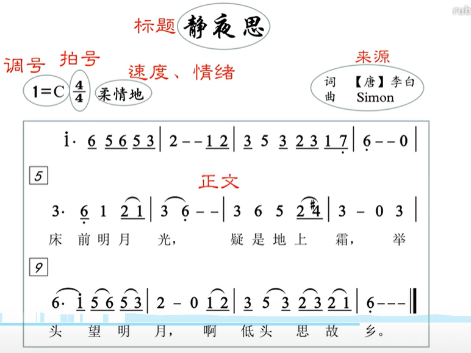

简谱的构造：标题 来源 调号 拍号 速度和情绪 正文

~~~
        1    2    3    4    5    6    7  
 唱名   do   re   mi   fa   sol  la   si
~~~

 1234567和do re mi fa sol la si的对应关系是固定的，永远不变

# 认识音名

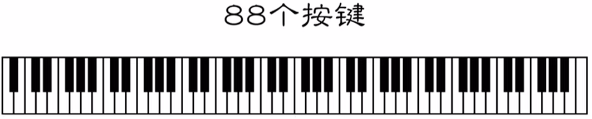
钢琴88个按键

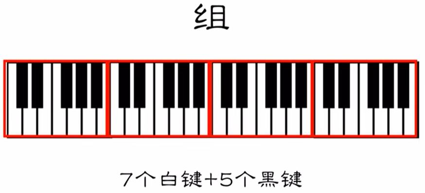

钢琴按键的音名是永远都不会变的，永远都是CDEFGAB
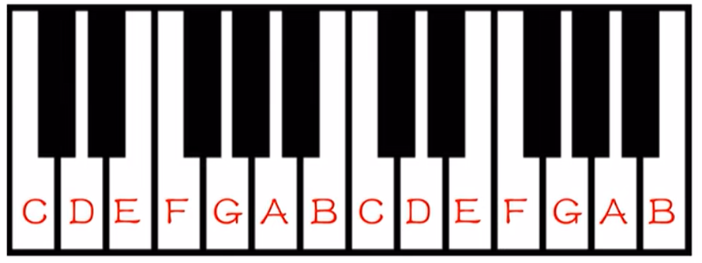

# 初步理解1=C

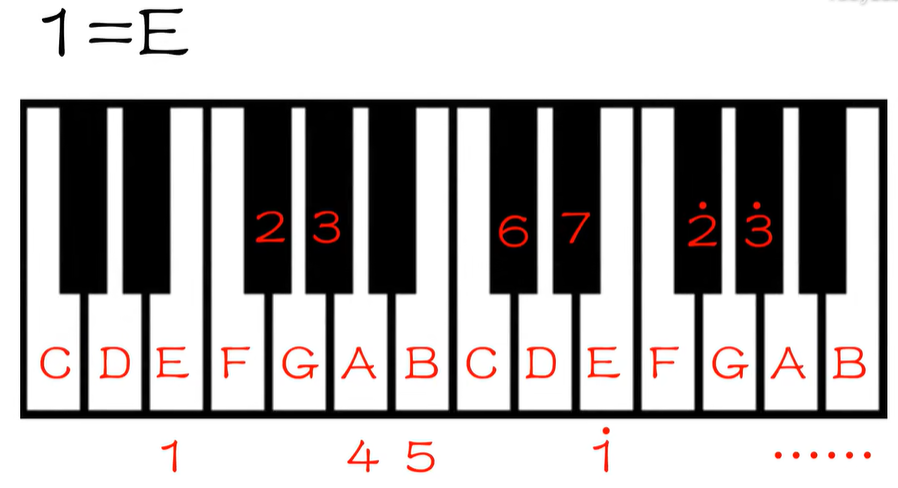

1=？ 1就从？键上出发

1的位置一旦确定，234567的位置也跟着确定

# 黑键怎么表示

钢琴右边的音始终比左边的要高

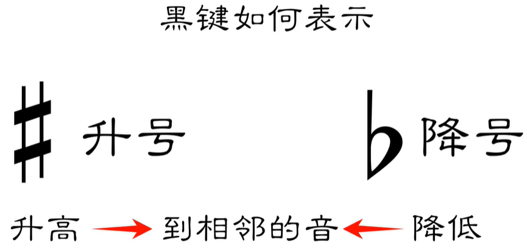

在基础乐理的范围内，音乐的高度差最小为半音

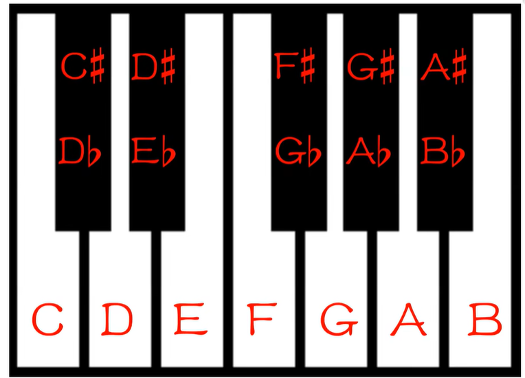

# 半音 & 全音

## 半音

相邻的两个音，它们之间的距离就是一个半音

## 全音

两个音之间的距离，它的长度是半音的两倍

# 12345671的内在规则

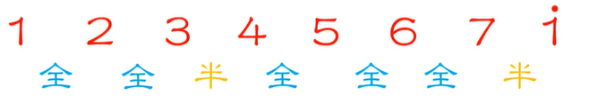

# 调式中的（自然）大调

## 什么是调式
一串音，按照一定的规则排列起来
## 什么是自然大调
将12345671，按照全全半全全全半的规则排列起来，就是自然大调

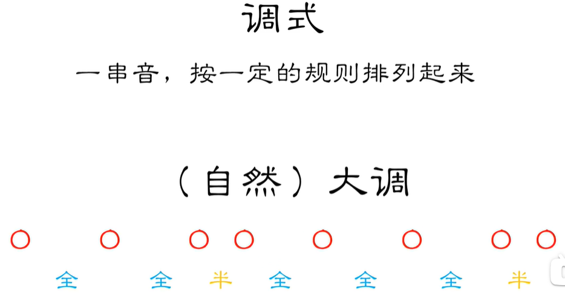

# 构建（自然）大调的音阶

## 什么是音阶
一个调式里面，它所使用的的这些音，按照从低到高的顺序排列起来，由主音开始，主音结束

## 自然大调音阶

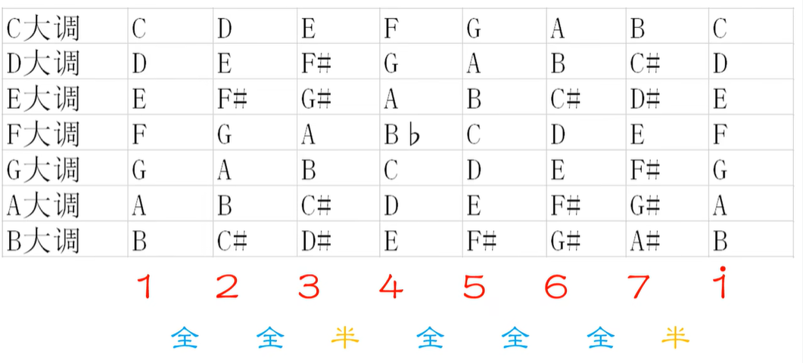

# 黑键开始的（自然）大调

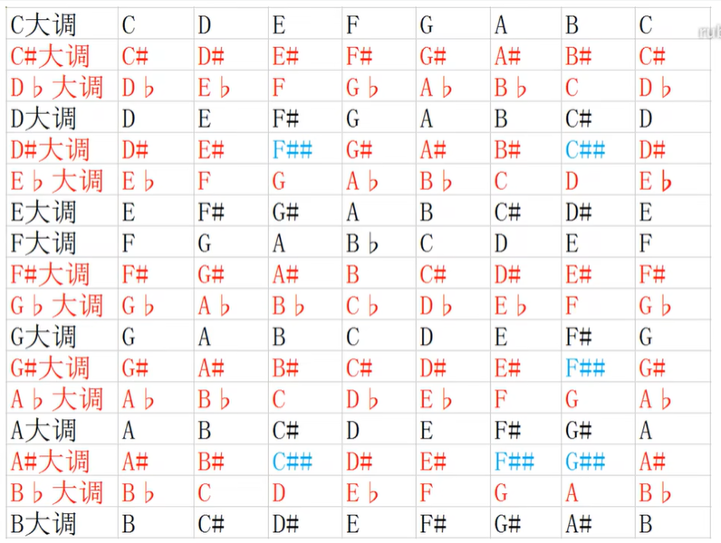

# 1=C 到底是哪个C

## C-第一种表示法

### 钢琴琴键分组方式
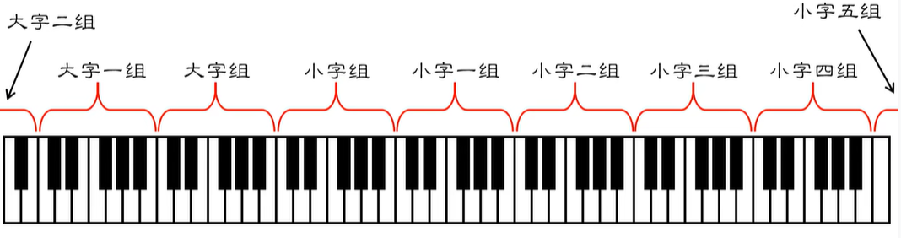
### C
<!-- 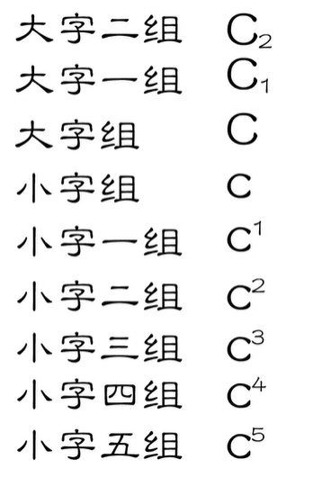 -->

大字二组 C2  
大字一组 C1  
大字组   C  
小字组   c  
小字一组 c1  
小字二组 c2  
小字三组 c3  
小字四组 c4  
小字五组 c5  

## C-第二种表示法

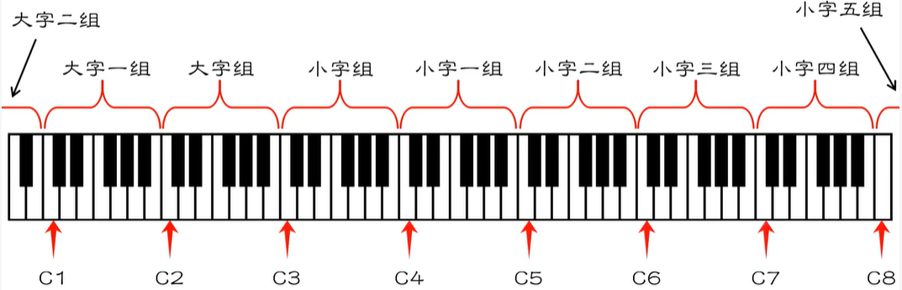

## 钢琴和人声的音域

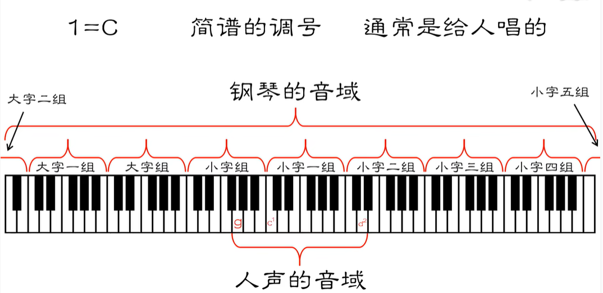

## 1=C到底是哪个C

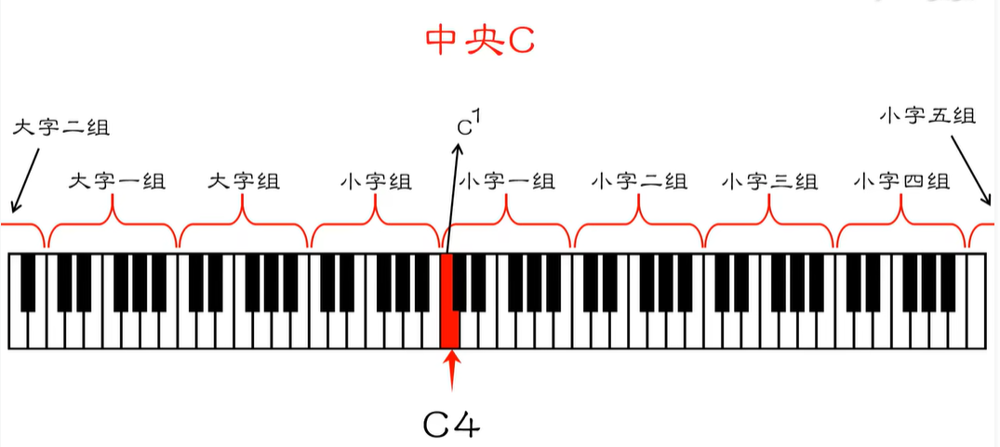

# 音符的名称、小节
2/4 以4分音符为一拍，每小节2拍

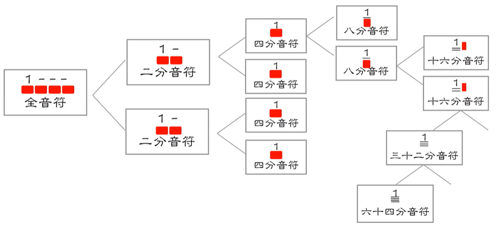

# 附点、休止符
附点：延长它前面这一个音符本身时间的一半

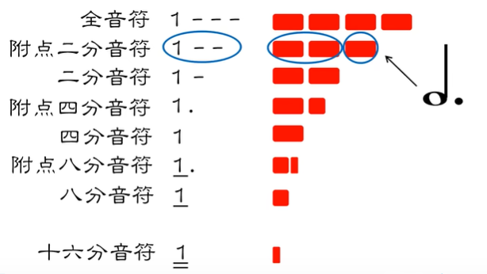

休止符与音符类似

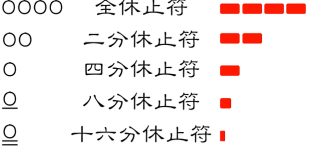

# 常用的四拍子

2/4 3/4 4/4

# 常用的八拍子

# 强弱关系、单拍子、复拍子

单拍子：每一个小节都有强有弱，但强拍只有一个(2/4 3/4 3/8)
复拍子：由两个或者两个以上相同的单拍子组合起来(4/4 6/8 9/8)

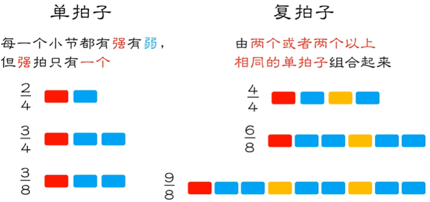

# 混合拍子

混合拍子： 由两个或两个以上不同的单拍子组合起来

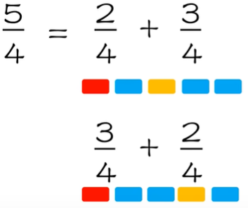

# 一拍子、散拍子
# 四拍子怎么唱（1）-打拍子
# 四拍子怎么唱（2）-二八
# 四拍子怎么唱（3）-四十六
# 四拍子怎么唱（4）-前八后十六
# 四拍子怎么唱（5）-前后附点
# 四拍子怎么唱（6）-小切分
# 四拍子怎么唱（7）-大附点、大切分
# 八拍子怎么唱（1）-打拍子
# 八拍子怎么唱（2）-其它节奏型
# 连线与延音线
# 简谱与五线谱的区别（1）-单声部与多声部
# 简谱与五线谱的区别（2）-首调与固定调
# 初识五线谱的构造
# 高音谱号
# 低音谱号
# 中音谱号、次中音谱号
# 度、八度记号
